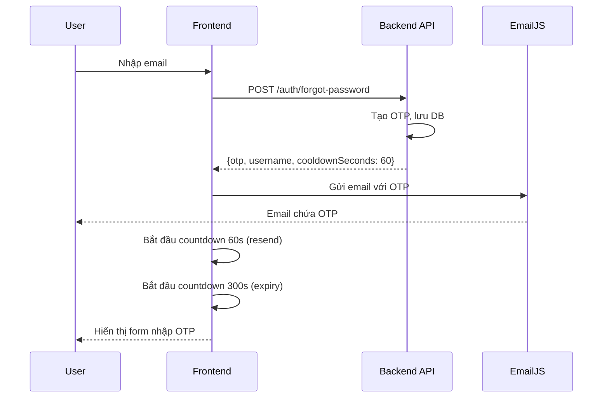
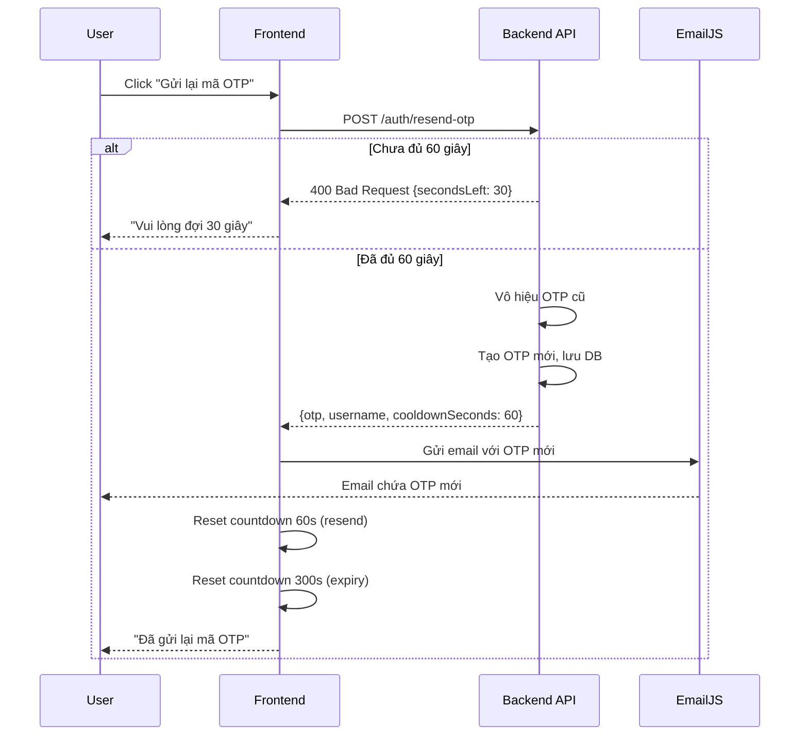

# 🔐 Tính Năng Gửi Lại Mã OTP

## ✅ Đã Hoàn Thành

Đã thêm tính năng **gửi lại mã OTP** với countdown timer và giới hạn thời gian vào hệ thống quên mật khẩu.

---

## 🎯 Tính Năng

### 1. **Countdown Timer Gửi Lại OTP** ⏱️
- Người dùng phải đợi **60 giây** (1 phút) trước khi có thể gửi lại mã OTP
- Hiển thị countdown real-time: "Gửi lại mã sau 60s", "59s", "58s"...
- Nút "Gửi lại mã OTP" bị disable trong thời gian cooldown
- Sau 60 giây, nút sẽ active và có thể click

### 2. **Countdown Hết Hạn OTP** ⏰
- Mã OTP có hiệu lực **5 phút** (300 giây)
- Hiển thị countdown: "Mã OTP sẽ hết hạn sau 5:00", "4:59", "4:58"...
- Khi hết thời gian, tự động hiển thị thông báo và quay về bước 1
- Format thời gian: MM:SS (ví dụ: 5:00, 4:30, 0:45)

### 3. **Backend API Endpoint** 🔌
- Endpoint: `POST /api/Auth/resend-otp`
- Request body:
  ```json
  {
    "TenDangNhap": "admin"
  }
  ```
- Response:
  ```json
  {
    "otp": "123456",
    "tenDangNhap": "admin",
    "tenNhanVien": "Nguyễn Văn A",
    "cooldownSeconds": 60
  }
  ```

### 4. **Bảo Mật** 🔒
- **Cooldown 60 giây**: Chống spam request gửi OTP
- **OTP hết hạn sau 5 phút**: Giảm rủi ro bị đánh cắp
- **Hash OTP trong database**: Không lưu plain text
- **Vô hiệu hóa OTP cũ**: Khi gửi lại, OTP cũ bị xóa
- **Rate limiting**: Backend kiểm tra thời gian giữa các request

---

## 🎨 Giao Diện

### Bước 2: Nhập OTP

```
┌─────────────────────────────────────┐
│   Nhập mã gồm 6 chữ số đã gửi       │
│                                     │
│        [_ _ _ _ _ _]                │
│                                     │
│  Mã OTP sẽ hết hạn sau 4:35         │
│                                     │
│  🔄 Gửi lại mã sau 45s              │  ← Disabled, đếm ngược
│                                     │
└─────────────────────────────────────┘
```

Sau 60 giây:

```
┌─────────────────────────────────────┐
│   Nhập mã gồm 6 chữ số đã gửi       │
│                                     │
│        [_ _ _ _ _ _]                │
│                                     │
│  Mã OTP sẽ hết hạn sau 3:35         │
│                                     │
│  🔄 Gửi lại mã OTP                  │  ← Active, có thể click
│                                     │
└─────────────────────────────────────┘
```

---

## 🔄 Luồng Hoạt Động

### Luồng Gửi OTP Lần Đầu



### Luồng Gửi Lại OTP



---

## 💻 Code Changes

### Backend: AuthController.cs

#### Endpoint Mới: `/resend-otp`

```csharp
[HttpPost("resend-otp")]
public async Task<IActionResult> ResendOtp([FromBody] ResendOtpRequest request)
{
    // Tìm tài khoản
    var user = await _context.TaiKhoans
        .Include(t => t.NhanVien)
        .FirstOrDefaultAsync(t => t.TenDangNhap == request.TenDangNhap);

    if (user == null)
        return BadRequest("Tài khoản không tồn tại!");

    // Kiểm tra COOLDOWN: 60 giây
    var otpHienTai = await _context.OtpRequests
        .Where(o => o.TenDangNhap == request.TenDangNhap && !o.DaSDung)
        .OrderByDescending(o => o.CreatedAt)
        .FirstOrDefaultAsync();

    const int COOLDOWN_SECONDS = 60;

    if (otpHienTai != null)
    {
        var secondsElapsed = (DateTime.Now - otpHienTai.CreatedAt).TotalSeconds;

        if (secondsElapsed < COOLDOWN_SECONDS)
        {
            int secondsLeft = (int)(COOLDOWN_SECONDS - secondsElapsed);
            return BadRequest(new
            {
                message = $"Vui lòng đợi thêm {secondsLeft} giây trước khi yêu cầu mã mới!",
                secondsLeft = secondsLeft
            });
        }

        // Vô hiệu hóa OTP cũ
        _context.OtpRequests.Remove(otpHienTai);
    }

    // Tạo OTP mới
    string otpCode = new Random().Next(100000, 999999).ToString();

    _context.OtpRequests.Add(new POS36.Api.Models.OtpRequest
    {
        TenDangNhap = user.TenDangNhap,
        OtpHash = BCrypt.Net.BCrypt.HashPassword(otpCode),
        ExpiresAt = DateTime.Now.AddMinutes(5),
        CreatedAt = DateTime.Now,
        DaSDung = false
    });
    await _context.SaveChangesAsync();

    return Ok(new
    {
        otp = otpCode,
        tenDangNhap = user.TenDangNhap,
        tenNhanVien = user.NhanVien?.TenNhanVien,
        cooldownSeconds = COOLDOWN_SECONDS
    });
}
```

#### DTO Mới: ResendOtpRequest

```csharp
public class ResendOtpRequest
{
    public string TenDangNhap { get; set; } = string.Empty;
}
```

### Frontend: ForgotPasswordView.vue

#### State Variables

```javascript
const resendCooldown = ref(0); // Countdown gửi lại (60s)
const otpExpiryCountdown = ref(300); // Countdown hết hạn (300s)
const isResending = ref(false);
let resendInterval = null;
let expiryInterval = null;
```

#### Helper Functions

```javascript
// Format thời gian MM:SS
const formatTime = (seconds) => {
  const mins = Math.floor(seconds / 60);
  const secs = seconds % 60;
  return `${mins}:${secs.toString().padStart(2, '0')}`;
};

// Bắt đầu countdown gửi lại
const startResendCooldown = (seconds = 60) => {
  resendCooldown.value = seconds;
  if (resendInterval) clearInterval(resendInterval);
  resendInterval = setInterval(() => {
    resendCooldown.value--;
    if (resendCooldown.value <= 0) {
      clearInterval(resendInterval);
    }
  }, 1000);
};

// Bắt đầu countdown hết hạn
const startOtpExpiryCountdown = () => {
  otpExpiryCountdown.value = 300;
  if (expiryInterval) clearInterval(expiryInterval);
  expiryInterval = setInterval(() => {
    otpExpiryCountdown.value--;
    if (otpExpiryCountdown.value <= 0) {
      clearInterval(expiryInterval);
      // Hiển thị thông báo hết hạn
      swal.fire({
        icon: "warning",
        title: "Mã OTP đã hết hạn",
        text: "Vui lòng yêu cầu mã mới!",
      }).then(() => {
        step.value = 1;
      });
    }
  }, 1000);
};
```

#### Resend OTP Function

```javascript
const resendOtp = async () => {
  if (resendCooldown.value > 0) return;
  
  isResending.value = true;
  try {
    const res = await axios.post("/api/Auth/resend-otp", {
      TenDangNhap: form.value.username,
    });

    const otpCode = res.data.otp;
    const fullName = res.data.tenNhanVien;
    const cooldownSeconds = res.data.cooldownSeconds || 60;

    // Gửi email mới
    await emailjs.send(
      "service_65xya5u",
      "template_a63e1vv",
      {
        to_email: form.value.email,
        to_name: fullName,
        otp_code: otpCode,
      },
      "Zjm65dyIcuEbthcT3",
    );

    // Reset và bắt đầu countdown mới
    form.value.otp = "";
    startResendCooldown(cooldownSeconds);
    startOtpExpiryCountdown();

    swal.fire({
      icon: "success",
      title: "Đã gửi lại mã OTP",
      timer: 3000,
      showConfirmButton: false,
    });
  } catch (error) {
    // Xử lý lỗi cooldown
    if (error.response?.data?.secondsLeft) {
      const secondsLeft = error.response.data.secondsLeft;
      startResendCooldown(secondsLeft);
      swal.fire({
        icon: "warning",
        title: "Vui lòng đợi",
        text: error.response.data.message,
      });
    }
  } finally {
    isResending.value = false;
  }
};
```

#### UI Template

```vue
<div class="mt-3">
  <p class="text-muted small mb-2">
    Mã OTP sẽ hết hạn sau 
    <span class="fw-bold text-danger">{{ formatTime(otpExpiryCountdown) }}</span>
  </p>
  <button
    type="button"
    class="btn btn-link"
    :disabled="resendCooldown > 0 || isResending"
    @click="resendOtp"
  >
    <span v-if="isResending" class="spinner-border spinner-border-sm"></span>
    <span v-if="resendCooldown > 0">
      Gửi lại mã sau {{ resendCooldown }}s
    </span>
    <span v-else>
      🔄 Gửi lại mã OTP
    </span>
  </button>
</div>
```

---

## 🧪 Testing

### Test Cases

#### 1. Gửi OTP Lần Đầu
- ✅ Nhập email hợp lệ
- ✅ Nhận được OTP qua email
- ✅ Countdown 60s bắt đầu
- ✅ Countdown 5:00 bắt đầu
- ✅ Nút "Gửi lại" bị disable

#### 2. Gửi Lại OTP Trước 60 Giây
- ✅ Click nút "Gửi lại" (disabled)
- ✅ Không có request nào được gửi
- ✅ Hiển thị "Gửi lại mã sau Xs"

#### 3. Gửi Lại OTP Sau 60 Giây
- ✅ Nút "Gửi lại" active
- ✅ Click nút → Gửi request thành công
- ✅ Nhận OTP mới qua email
- ✅ Countdown reset về 60s
- ✅ Countdown expiry reset về 5:00
- ✅ Input OTP bị clear

#### 4. OTP Hết Hạn Sau 5 Phút
- ✅ Countdown đếm từ 5:00 → 0:00
- ✅ Hiển thị thông báo "Mã OTP đã hết hạn"
- ✅ Tự động quay về bước 1

#### 5. Spam Protection
- ✅ Gửi nhiều request liên tiếp
- ✅ Backend trả về lỗi với secondsLeft
- ✅ Frontend đồng bộ countdown với server

---

## 📊 Metrics

### Thời Gian
- **Cooldown gửi lại**: 60 giây (1 phút)
- **OTP hết hạn**: 300 giây (5 phút)
- **Update interval**: 1 giây

### Bảo Mật
- ✅ Rate limiting: 1 request/60 giây
- ✅ OTP TTL: 5 phút
- ✅ Hash OTP trong database
- ✅ Vô hiệu hóa OTP cũ khi gửi mới
- ✅ Chống replay attack

---

## 🚀 Deployment

### Backend
Không cần migration mới - sử dụng bảng `OtpRequests` đã có.

### Frontend
Không cần cài thêm dependencies - sử dụng Vue 3 built-in features.

### Environment Variables
Không cần thêm biến môi trường mới.

---

## 📝 Notes

### Tùy Chỉnh Thời Gian

Để thay đổi thời gian cooldown hoặc expiry:

**Backend** (`AuthController.cs`):
```csharp
const int COOLDOWN_SECONDS = 60; // Thay đổi ở đây (giây)
ExpiresAt = DateTime.Now.AddMinutes(5), // Thay đổi ở đây (phút)
```

**Frontend** (`ForgotPasswordView.vue`):
```javascript
const startResendCooldown = (seconds = 60) => { // Thay đổi ở đây
const startOtpExpiryCountdown = () => {
  otpExpiryCountdown.value = 300; // Thay đổi ở đây (giây)
```

### Cleanup

Component tự động cleanup intervals khi unmount:
```javascript
onUnmounted(() => {
  if (resendInterval) clearInterval(resendInterval);
  if (expiryInterval) clearInterval(expiryInterval);
});
```

---

## ✅ Checklist

- [x] Backend endpoint `/resend-otp`
- [x] DTO `ResendOtpRequest`
- [x] Cooldown 60 giây
- [x] OTP expiry 5 phút
- [x] Frontend countdown timers
- [x] UI nút "Gửi lại mã OTP"
- [x] Format thời gian MM:SS
- [x] Error handling
- [x] Spam protection
- [x] Auto cleanup intervals
- [x] Success/error notifications
- [x] Responsive design

---

<div align="center">

**✅ Tính Năng Hoàn Thành!**

Người dùng giờ có thể gửi lại mã OTP với countdown timer và giới hạn thời gian!

</div>
