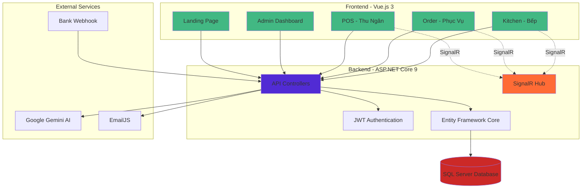
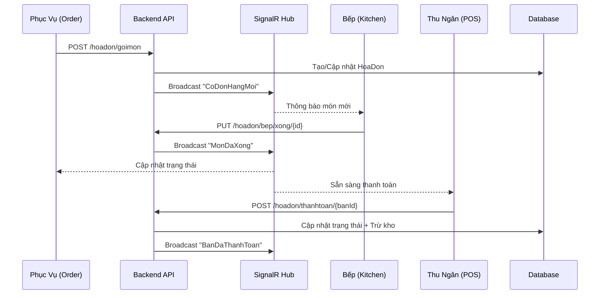
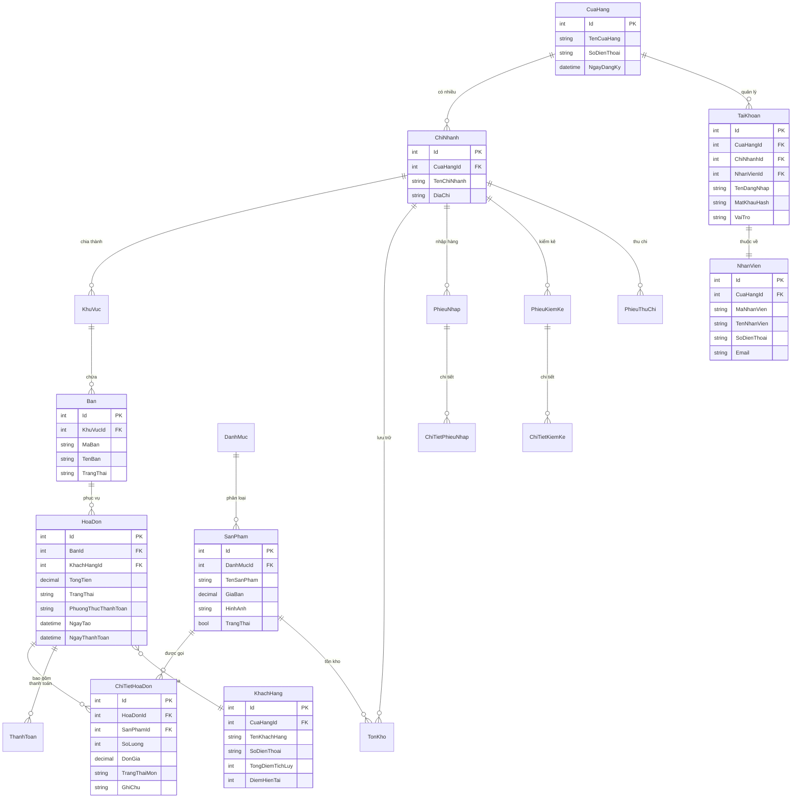
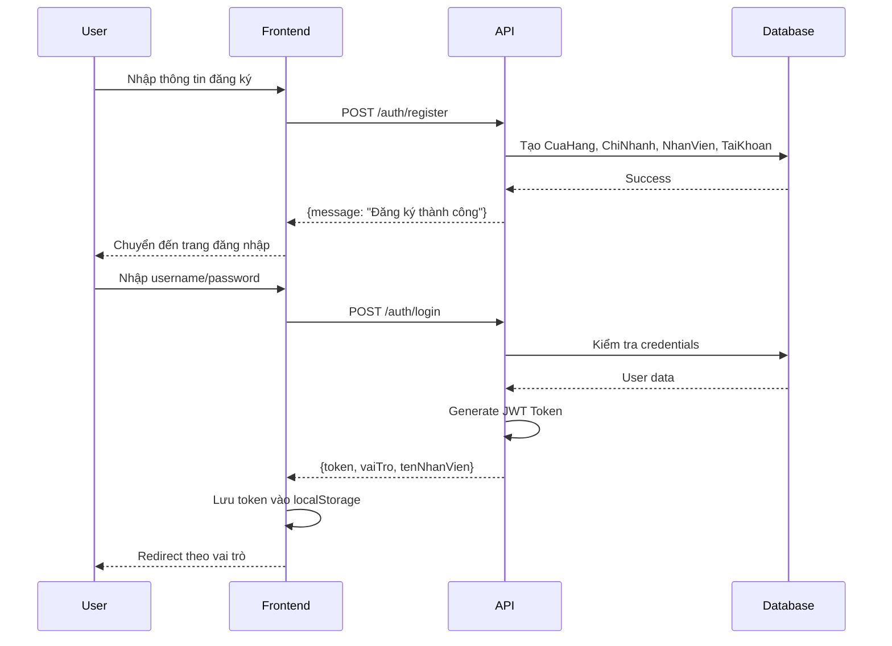
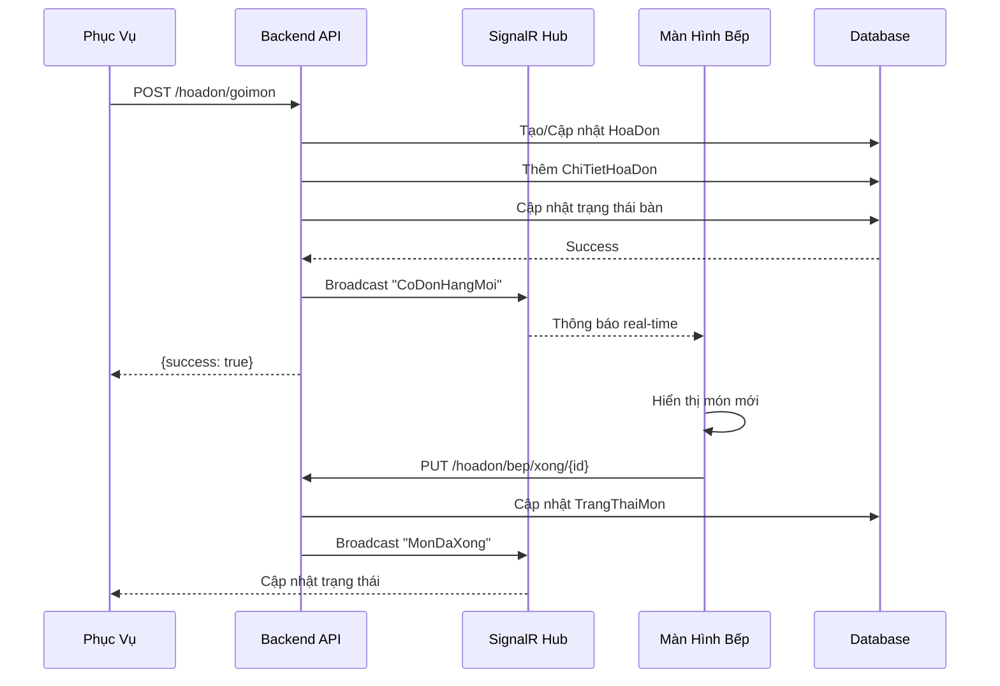
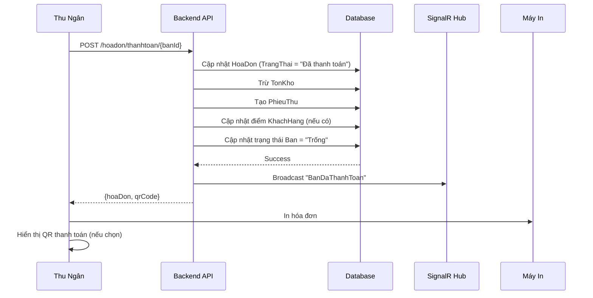
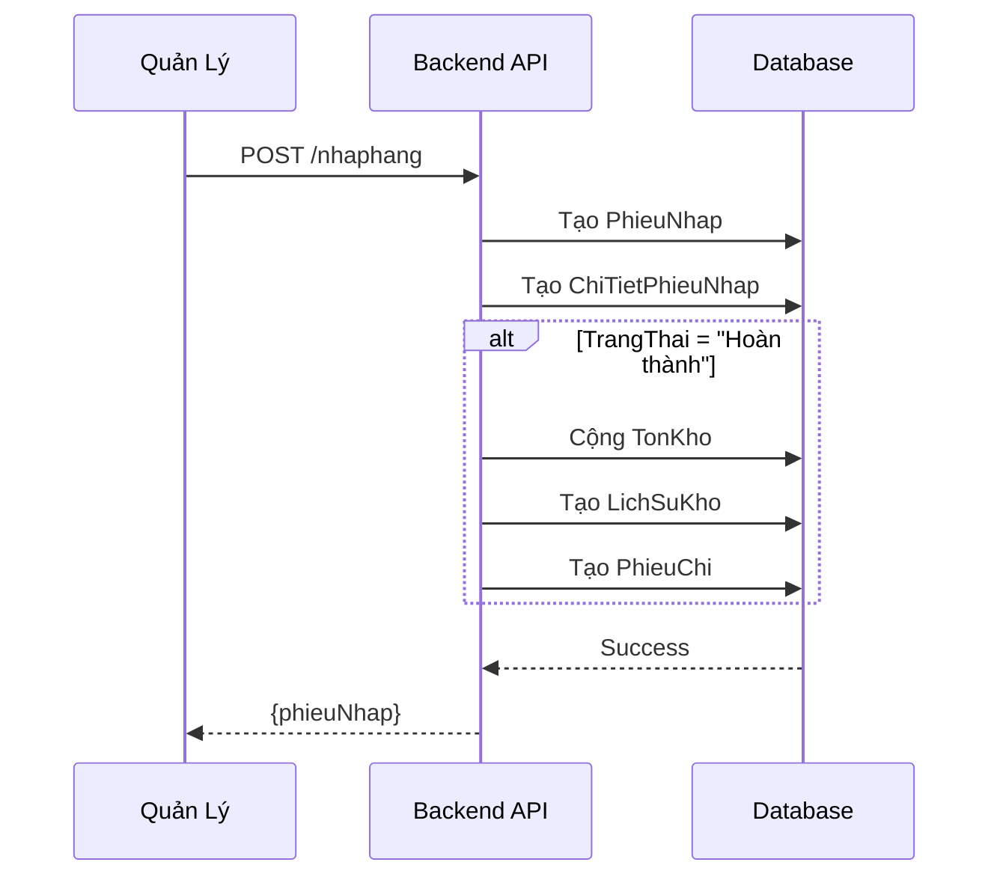
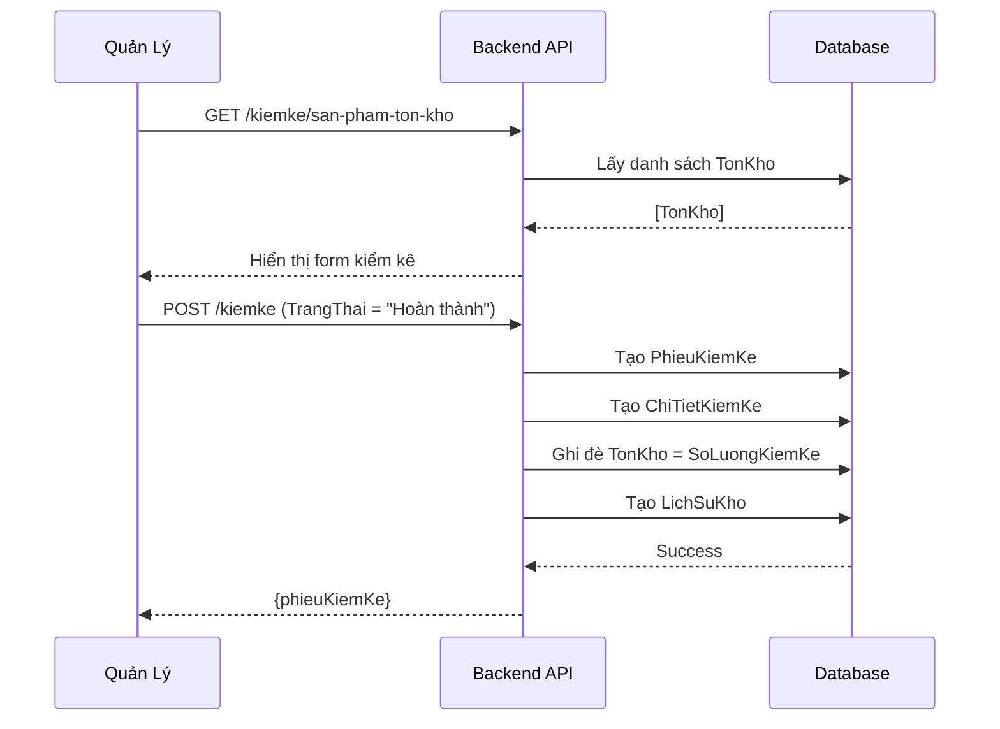

<div align="center">

```
 ██████╗  ██████╗  ██████╗ ██████╗  ██████╗
 ██╔══██╗██╔═══██╗██╔════╝ ╚════██╗ ██╔════╝
 ██████╔╝██║   ██║╚█████╗   █████╔╝ ███████╗
 ██╔═══╝ ██║   ██║ ╚═══██╗  ╚═══██╗ ██╔═══██╗
 ██║     ╚██████╔╝██████╔╝ ██████╔╝ ╚██████╔╝
 ╚═╝      ╚═════╝ ╚═════╝  ╚═════╝   ╚═════╝
```

# 🍽️ POS36 — Hệ Thống Quản Lý Bán Hàng F&B

**Giải pháp Point of Sale toàn diện dành cho Nhà hàng · Quán Cà phê · Cửa hàng Ăn uống**

[](https://dotnet.microsoft.com/)
[](https://vuejs.org/)
[](https://www.microsoft.com/sql-server)
[](https://dotnet.microsoft.com/apps/aspnet/signalr)
[](https://www.docker.com/)

[🚀 Bắt Đầu Nhanh](#-cài-đặt-nhanh-với-docker) · [📖 Tài Liệu](#-mục-lục) · [🎯 Tính Năng](#-tính-năng-nổi-bật) · [🏗️ Kiến Trúc](#-kiến-trúc-hệ-thống)

</div>

---

## 📋 Mục Lục

- [Giới Thiệu](#-giới-thiệu)
- [Tính Năng Nổi Bật](#-tính-năng-nổi-bật)
- [Kiến Trúc Hệ Thống](#-kiến-trúc-hệ-thống)
- [Mô Hình Dữ Liệu (ERD)](#-mô-hình-dữ-liệu-erd)
- [Use Case Diagram](#-use-case-diagram)
- [Cài Đặt Nhanh với Docker](#-cài-đặt-nhanh-với-docker)
- [Cài Đặt Thủ Công](#-cài-đặt-thủ-công)
- [Cài Đặt Tự Động (Windows)](#-cài-đặt-tự-động-windows)
- [Công Nghệ Sử Dụng](#-công-nghệ-sử-dụng)
- [API Documentation](#-api-documentation)
- [Phân Quyền & Bảo Mật](#-phân-quyền--bảo-mật)
- [Luồng Hoạt Động](#-luồng-hoạt-động)
- [Thông Tin Dự Án](#-thông-tin-dự-án)

---

## 🚀 Giới Thiệu

**POS36** là hệ thống quản lý bán hàng (Point of Sale) thế hệ mới, được thiết kế chuyên biệt cho mô hình kinh doanh F&B (Food & Beverage). Hệ thống cung cấp giải pháp toàn diện từ gọi món, quản lý bếp, thanh toán đến báo cáo kinh doanh với giao diện tối ưu cho từng vai trò.

### 🎯 Vấn Đề Giải Quyết

- ✅ Đồng bộ thông tin giữa Phục vụ - Bếp - Thu ngân theo thời gian thực
- ✅ Quản lý nhiều chi nhánh trong một hệ thống
- ✅ Theo dõi tồn kho, kiểm kê tự động
- ✅ Báo cáo doanh thu chi tiết, phân tích kinh doanh bằng AI
- ✅ Thanh toán linh hoạt (Tiền mặt, Chuyển khoản, QR Code)
- ✅ Quản lý khách hàng thân thiết, tích điểm

---

## ✨ Tính Năng Nổi Bật

### 🤖 AI Copilot Tích Hợp
- Trợ lý ảo **Google Gemini 2.5 Flash** hỗ trợ phân tích dữ liệu kinh doanh
- Tự động sinh báo cáo HTML từ dữ liệu thực tế
- Tư vấn kinh doanh theo thời gian thực

### 📡 Real-time với SignalR
- Đồng bộ tức thời: Phục vụ gọi món → Bếp nhận ngay lập tức
- Cập nhật trạng thái bàn real-time
- Thông báo thanh toán QR Code tự động

### 🏪 Multi-Branch Management
- Quản lý nhiều chi nhánh trong một tài khoản
- Theo dõi tồn kho riêng biệt cho từng chi nhánh
- Báo cáo doanh thu tổng hợp và chi tiết

### 🔐 Phân Quyền Chi Tiết (RBAC)
5 loại tài khoản với màn hình riêng biệt:
- **Chủ Cửa Hàng**: Toàn quyền quản lý
- **Quản Lý**: Quản lý chi nhánh, báo cáo
- **Thu Ngân**: Thanh toán, in hóa đơn
- **Phục Vụ**: Gọi món, chuyển/ghép bàn
- **Bếp**: Nhận order, cập nhật trạng thái món

### 📊 Báo Cáo Thông Minh
- Dashboard tổng quan với biểu đồ doanh thu 7 ngày
- Báo cáo doanh thu theo ngày/tháng/năm
- Sổ quỹ tự động (Thu/Chi)
- Báo cáo tồn kho, kiểm kê

### 💳 Thanh Toán Linh Hoạt
- Tiền mặt, Chuyển khoản, Thẻ
- QR Code ngân hàng tự động
- Webhook nhận thông báo chuyển khoản
- In hóa đơn với mẫu tùy chỉnh

### 👥 Quản Lý Khách Hàng
- Hệ thống tích điểm thành viên
- Lịch sử mua hàng chi tiết
- Phân tích hành vi khách hàng

---

## 🏗️ Kiến Trúc Hệ Thống



### Luồng Dữ Liệu Chính



---

## 🗄️ Mô Hình Dữ Liệu (ERD)

### Sơ Đồ ERD Tổng Quan



### Phân Hệ Dữ Liệu

#### 1️⃣ Phân Hệ Quản Trị & Nhân Sự
- `CuaHang`: Thông tin cửa hàng
- `ChiNhanh`: Chi nhánh
- `TaiKhoan`: Đăng nhập & phân quyền
- `NhanVien`: Hồ sơ nhân viên
- `KhachHang`: Khách hàng thành viên

#### 2️⃣ Phân Hệ Bán Hàng
- `KhuVuc`: Khu vực (Tầng 1, Tầng 2...)
- `Ban`: Bàn ăn
- `DanhMuc`: Danh mục sản phẩm
- `SanPham`: Sản phẩm/Món ăn
- `HoaDon`: Hóa đơn
- `ChiTietHoaDon`: Chi tiết món trong hóa đơn
- `ThanhToan`: Lịch sử thanh toán

#### 3️⃣ Phân Hệ Kho
- `TonKho`: Tồn kho theo chi nhánh
- `PhieuNhap`: Phiếu nhập hàng
- `ChiTietPhieuNhap`: Chi tiết phiếu nhập
- `LichSuKho`: Lịch sử biến động kho

#### 4️⃣ Phân Hệ Kiểm Kê
- `PhieuKiemKe`: Phiếu kiểm kê
- `ChiTietKiemKe`: Chi tiết kiểm kê

#### 5️⃣ Phân Hệ Tài Chính
- `PhieuThuChi`: Sổ quỹ thu/chi

#### 6️⃣ Phân Hệ Cấu Hình
- `ThietLap`: Cấu hình hệ thống (JSON)

---

## 🎭 Use Case Diagram

```mermaid
graph TB
    subgraph "Actors"
        CCH[Chủ Cửa Hàng]
        QL[Quản Lý]
        TN[Thu Ngân]
        PV[Phục Vụ]
        BEP[Bếp]
        KH[Khách Hàng]
    end
    
    subgraph "Quản Trị Hệ Thống"
        UC1[Đăng ký cửa hàng]
        UC2[Quản lý chi nhánh]
        UC3[Quản lý nhân viên]
        UC4[Phân quyền tài khoản]
        UC5[Cấu hình hệ thống]
    end
    
    subgraph "Quản Lý Sản Phẩm"
        UC6[Quản lý danh mục]
        UC7[Quản lý sản phẩm]
        UC8[Thiết lập giá bán]
        UC9[Upload hình ảnh]
    end
    
    subgraph "Bán Hàng"
        UC10[Thiết lập sơ đồ bàn]
        UC11[Gọi món]
        UC12[Chuyển bàn]
        UC13[Ghép bàn]
        UC14[Hủy món]
        UC15[Chế biến món]
        UC16[Thanh toán]
        UC17[In hóa đơn]
    end
    
    subgraph "Quản Lý Kho"
        UC18[Nhập hàng]
        UC19[Kiểm kê kho]
        UC20[Xem tồn kho]
        UC21[Lịch sử biến động]
    end
    
    subgraph "Tài Chính"
        UC22[Quản lý sổ quỹ]
        UC23[Phiếu thu/chi]
        UC24[Báo cáo doanh thu]
        UC25[Dashboard]
    end
    
    subgraph "Khách Hàng"
        UC26[Đăng ký thành viên]
        UC27[Tích điểm]
        UC28[Đổi điểm]
    end
    
    subgraph "AI & Báo Cáo"
        UC29[AI Copilot]
        UC30[Báo cáo AI]
        UC31[Phân tích kinh doanh]
    end
    
    CCH --> UC1
    CCH --> UC2
    CCH --> UC3
    CCH --> UC4
    CCH --> UC5
    
    QL --> UC6
    QL --> UC7
    QL --> UC8
    QL --> UC9
    QL --> UC10
    
    PV --> UC11
    PV --> UC12
    PV --> UC13
    PV --> UC14
    
    BEP --> UC15
    
    TN --> UC16
    TN --> UC17
    TN --> UC26
    TN --> UC27
    
    QL --> UC18
    QL --> UC19
    QL --> UC20
    QL --> UC21
    
    QL --> UC22
    QL --> UC23
    QL --> UC24
    QL --> UC25
    
    CCH --> UC29
    CCH --> UC30
    CCH --> UC31
    
    KH -.-> UC26
    KH -.-> UC27
    KH -.-> UC28
    
    style CCH fill:#ff6b6b
    style QL fill:#4ecdc4
    style TN fill:#45b7d1
    style PV fill:#96ceb4
    style BEP fill:#ffeaa7
    style KH fill:#dfe6e9
```



### Chi Tiết Use Cases

#### 🔐 Quản Trị Hệ Thống
| Use Case | Actor | Mô Tả |
|----------|-------|-------|
| Đăng ký cửa hàng | Chủ Cửa Hàng | Tạo tài khoản mới, khởi tạo chi nhánh đầu tiên |
| Quản lý chi nhánh | Chủ Cửa Hàng | Thêm/sửa/xóa chi nhánh |
| Quản lý nhân viên | Chủ Cửa Hàng, Quản Lý | CRUD nhân viên, cấp tài khoản |
| Phân quyền | Chủ Cửa Hàng | Gán vai trò cho nhân viên |
| Cấu hình | Chủ Cửa Hàng, Quản Lý | Thiết lập mẫu in, QR ngân hàng |

#### 🛍️ Bán Hàng
| Use Case | Actor | Mô Tả |
|----------|-------|-------|
| Gọi món | Phục Vụ | Chọn bàn, thêm món, gửi xuống bếp |
| Chuyển bàn | Phục Vụ | Di chuyển hóa đơn sang bàn khác |
| Ghép bàn | Phục Vụ | Gộp 2 hóa đơn thành 1 |
| Chế biến món | Bếp | Nhận order, đánh dấu món xong |
| Thanh toán | Thu Ngân | Tính tiền, chọn phương thức, in hóa đơn |

#### 📦 Quản Lý Kho
| Use Case | Actor | Mô Tả |
|----------|-------|-------|
| Nhập hàng | Quản Lý | Tạo phiếu nhập, cập nhật tồn kho |
| Kiểm kê | Quản Lý | Đối chiếu tồn kho thực tế |
| Xem tồn kho | Quản Lý | Theo dõi số lượng tồn |

#### 💰 Tài Chính
| Use Case | Actor | Mô Tả |
|----------|-------|-------|
| Sổ quỹ | Quản Lý | Quản lý thu/chi, xem tồn quỹ |
| Báo cáo | Chủ Cửa Hàng, Quản Lý | Doanh thu, lợi nhuận, top sản phẩm |
| Dashboard | Chủ Cửa Hàng, Quản Lý | Tổng quan kinh doanh |

---

## 🐳 Cài Đặt Nhanh với Docker

### Yêu Cầu
- Docker Desktop (Windows/Mac) hoặc Docker Engine (Linux)
- 4GB RAM trở lên
- 10GB dung lượng ổ cứng

### Bước 1: Clone Repository

```bash
git clone https://github.com/Nhanduc2912/POS36.git
cd POS36
```

### Bước 2: Chạy Docker Compose

```bash
docker-compose up -d
```

### Bước 3: Khởi Tạo Database

Đợi khoảng 30 giây để SQL Server khởi động, sau đó chạy:

```bash
# Windows PowerShell
docker exec -it pos36-db /opt/mssql-tools/bin/sqlcmd -S localhost -U sa -P "Pos36_Secret_Password_123!" -i /Pos36DB.sql

# Linux/Mac
docker exec -it pos36-db /opt/mssql-tools/bin/sqlcmd -S localhost -U sa -P 'Pos36_Secret_Password_123!' -i /Pos36DB.sql
```

### Bước 4: Truy Cập Ứng Dụng

- **Frontend**: http://localhost:3000
- **Backend API**: http://localhost:5098
- **Swagger UI**: http://localhost:5098/swagger

### Dừng Hệ Thống

```bash
docker-compose down
```

### Xóa Dữ Liệu (Reset)

```bash
docker-compose down -v
```

---

## 🛠️ Cài Đặt Thủ Công

### Yêu Cầu Hệ Thống

#### Backend
- .NET 9.0 SDK
- SQL Server 2019 trở lên (hoặc SQL Server Express)
- Visual Studio 2022 / VS Code

#### Frontend
- Node.js 18+ và npm
- VS Code (khuyến nghị)

### Bước 1: Cài Đặt SQL Server

#### Windows
1. Tải SQL Server Express: https://www.microsoft.com/sql-server/sql-server-downloads
2. Cài đặt với Windows Authentication
3. Tải SQL Server Management Studio (SSMS)

#### Linux/Mac
```bash
# Sử dụng Docker
docker run -e "ACCEPT_EULA=Y" -e "SA_PASSWORD=YourStrong@Passw0rd" \
   -p 1433:1433 --name sqlserver \
   -d mcr.microsoft.com/mssql/server:2022-latest
```

### Bước 2: Tạo Database

1. Mở SSMS hoặc Azure Data Studio
2. Kết nối đến SQL Server
3. Mở file `Pos36DB.sql`
4. Thực thi script để tạo database

### Bước 3: Cấu Hình Backend

```bash
cd POS36.Api
```

Sửa file `appsettings.json`:

```json
{
  "ConnectionStrings": {
    "DefaultConnection": "Server=localhost;Database=POS36_Db;User Id=sa;Password=YourPassword;TrustServerCertificate=True;"
  },
  "Jwt": {
    "Key": "your-secret-key-at-least-32-characters-long",
    "Issuer": "POS36Api",
    "Audience": "POS36Client"
  },
  "GeminiApiKey": "your-google-gemini-api-key"
}
```

Cài đặt dependencies và chạy:

```bash
dotnet restore
dotnet ef database update
dotnet run
```

Backend sẽ chạy tại: http://localhost:5098

### Bước 4: Cấu Hình Frontend

```bash
cd POS36.Web
npm install
```

Tạo file `.env`:

```env
VITE_API_URL=http://localhost:5098/api
VITE_SIGNALR_URL=http://localhost:5098/kitchenHub
```

Chạy development server:

```bash
npm run dev
```

Frontend sẽ chạy tại: http://localhost:5173

### Bước 5: Build Production

#### Backend
```bash
cd POS36.Api
dotnet publish -c Release -o ./publish
```

#### Frontend
```bash
cd POS36.Web
npm run build
```

---

## ⚡ Cài Đặt Tự Động (Windows)

Tôi đã tạo các file BAT để tự động hóa quá trình cài đặt và chạy.

### File 1: `setup.bat` - Cài Đặt Tự Động


Tạo file `setup.bat` trong thư mục gốc:

```batch
@echo off
chcp 65001 >nul
echo ╔════════════════════════════════════════════════════════════╗
echo ║         POS36 - Cài Đặt Tự Động                           ║
echo ║         Hệ Thống Quản Lý Bán Hàng F&B                      ║
echo ╚════════════════════════════════════════════════════════════╝
echo.

REM Kiểm tra quyền Administrator
net session >nul 2>&1
if %errorLevel% neq 0 (
    echo [ERROR] Vui lòng chạy file này với quyền Administrator!
    pause
    exit /b 1
)

echo [1/6] Kiểm tra .NET SDK...
dotnet --version >nul 2>&1
if %errorLevel% neq 0 (
    echo [ERROR] Chưa cài đặt .NET 9.0 SDK!
    echo Vui lòng tải tại: https://dotnet.microsoft.com/download/dotnet/9.0
    pause
    exit /b 1
)
echo [OK] .NET SDK đã cài đặt

echo.
echo [2/6] Kiểm tra Node.js...
node --version >nul 2>&1
if %errorLevel% neq 0 (
    echo [ERROR] Chưa cài đặt Node.js!
    echo Vui lòng tải tại: https://nodejs.org/
    pause
    exit /b 1
)
echo [OK] Node.js đã cài đặt

echo.
echo [3/6] Kiểm tra SQL Server...
sqlcmd -? >nul 2>&1
if %errorLevel% neq 0 (
    echo [WARNING] Chưa cài đặt SQL Server hoặc sqlcmd!
    echo Bạn có thể:
    echo   1. Cài SQL Server Express: https://www.microsoft.com/sql-server/sql-server-downloads
    echo   2. Hoặc sử dụng Docker: docker run -e "ACCEPT_EULA=Y" -e "SA_PASSWORD=Pos36_Secret_Password_123!" -p 1433:1433 -d mcr.microsoft.com/mssql/server:2022-latest
    echo.
    set /p continue="Tiếp tục cài đặt? (y/n): "
    if /i not "%continue%"=="y" exit /b 1
) else (
    echo [OK] SQL Server đã cài đặt
)

echo.
echo [4/6] Cài đặt Backend Dependencies...
cd POS36.Api
dotnet restore
if %errorLevel% neq 0 (
    echo [ERROR] Lỗi khi cài đặt Backend dependencies!
    pause
    exit /b 1
)
echo [OK] Backend dependencies đã cài đặt

echo.
echo [5/6] Cài đặt Frontend Dependencies...
cd ..\POS36.Web
call npm install
if %errorLevel% neq 0 (
    echo [ERROR] Lỗi khi cài đặt Frontend dependencies!
    pause
    exit /b 1
)
echo [OK] Frontend dependencies đã cài đặt

echo.
echo [6/6] Tạo Database...
cd ..
echo Vui lòng cấu hình Connection String trong POS36.Api\appsettings.json
echo Sau đó chạy: dotnet ef database update -p POS36.Api
echo.

echo ╔════════════════════════════════════════════════════════════╗
echo ║  Cài đặt hoàn tất!                                         ║
echo ║  Chạy file run.bat để khởi động hệ thống                   ║
echo ╚════════════════════════════════════════════════════════════╝
pause
```

### File 2: `run.bat` - Chạy Hệ Thống

Tạo file `run.bat` trong thư mục gốc:

```batch
@echo off
chcp 65001 >nul
echo ╔════════════════════════════════════════════════════════════╗
echo ║         POS36 - Khởi Động Hệ Thống                        ║
echo ╚════════════════════════════════════════════════════════════╝
echo.

REM Tạo thư mục logs nếu chưa có
if not exist "logs" mkdir logs

echo [1/2] Khởi động Backend API...
start "POS36 Backend" cmd /k "cd POS36.Api && dotnet run > ..\logs\backend.log 2>&1"
timeout /t 5 /nobreak >nul

echo [2/2] Khởi động Frontend...
start "POS36 Frontend" cmd /k "cd POS36.Web && npm run dev > ..\logs\frontend.log 2>&1"

echo.
echo ╔════════════════════════════════════════════════════════════╗
echo ║  Hệ thống đang khởi động...                                ║
echo ║                                                            ║
echo ║  Backend API:  http://localhost:5098                       ║
echo ║  Swagger UI:   http://localhost:5098/swagger               ║
echo ║  Frontend:     http://localhost:5173                       ║
echo ║                                                            ║
echo ║  Đóng cửa sổ này để dừng hệ thống                          ║
echo ╚════════════════════════════════════════════════════════════╝
echo.
echo Nhấn Ctrl+C để dừng...
pause >nul
```

### File 3: `stop.bat` - Dừng Hệ Thống

Tạo file `stop.bat` trong thư mục gốc:

```batch
@echo off
chcp 65001 >nul
echo ╔════════════════════════════════════════════════════════════╗
echo ║         POS36 - Dừng Hệ Thống                             ║
echo ╚════════════════════════════════════════════════════════════╝
echo.

echo Đang dừng Backend...
taskkill /FI "WindowTitle eq POS36 Backend*" /F >nul 2>&1

echo Đang dừng Frontend...
taskkill /FI "WindowTitle eq POS36 Frontend*" /F >nul 2>&1

echo Đang dừng các process Node.js và dotnet...
taskkill /IM node.exe /F >nul 2>&1
taskkill /IM dotnet.exe /F >nul 2>&1

echo.
echo [OK] Hệ thống đã dừng!
timeout /t 2 /nobreak >nul
```

### File 4: `build.bat` - Build Production

Tạo file `build.bat` trong thư mục gốc:

```batch
@echo off
chcp 65001 >nul
echo ╔════════════════════════════════════════════════════════════╗
echo ║         POS36 - Build Production                           ║
echo ╚════════════════════════════════════════════════════════════╝
echo.

echo [1/2] Build Backend...
cd POS36.Api
dotnet publish -c Release -o ..\publish\backend
if %errorLevel% neq 0 (
    echo [ERROR] Lỗi khi build Backend!
    pause
    exit /b 1
)
echo [OK] Backend build thành công

echo.
echo [2/2] Build Frontend...
cd ..\POS36.Web
call npm run build
if %errorLevel% neq 0 (
    echo [ERROR] Lỗi khi build Frontend!
    pause
    exit /b 1
)
xcopy /E /I /Y dist ..\publish\frontend
echo [OK] Frontend build thành công

cd ..
echo.
echo ╔════════════════════════════════════════════════════════════╗
echo ║  Build hoàn tất!                                           ║
echo ║  Files nằm trong thư mục: publish\                         ║
echo ╚════════════════════════════════════════════════════════════╝
pause
```

### Hướng Dẫn Sử Dụng

1. **Lần đầu cài đặt**:
   ```
   Chuột phải vào setup.bat → Run as Administrator
   ```

2. **Chạy hệ thống**:
   ```
   Double click vào run.bat
   ```

3. **Dừng hệ thống**:
   ```
   Double click vào stop.bat
   ```

4. **Build production**:
   ```
   Double click vào build.bat
   ```

---

## 🔧 Công Nghệ Sử Dụng

### Backend Stack

| Công Nghệ | Phiên Bản | Mục Đích |
|-----------|-----------|----------|
| ASP.NET Core | 9.0 | Web API Framework |
| Entity Framework Core | 9.0 | ORM - Object Relational Mapping |
| SQL Server | 2022 | Relational Database |
| JWT Bearer | 9.0 | Authentication & Authorization |
| SignalR | Built-in | Real-time Communication |
| BCrypt.Net | 4.0.3 | Password Hashing |
| Serilog | 10.0.0 | Structured Logging |
| Swashbuckle | 7.2.0 | API Documentation (Swagger) |

### Frontend Stack

| Công Nghệ | Phiên Bản | Mục Đích |
|-----------|-----------|----------|
| Vue.js | 3.5.30 | Progressive JavaScript Framework |
| Vue Router | 5.0.3 | Client-side Routing |
| Vite | 8.0.0 | Build Tool & Dev Server |
| Axios | 1.13.6 | HTTP Client |
| Bootstrap | 5.3.8 | CSS Framework |
| Chart.js | 4.5.1 | Data Visualization |
| SweetAlert2 | 11.26.23 | Beautiful Alerts |
| XLSX | 0.18.5 | Excel Export |
| SignalR Client | 10.0.0 | Real-time Client |

### External Services

| Service | Mục Đích |
|---------|----------|
| Google Gemini 2.5 Flash | AI Copilot & Report Generation |
| EmailJS | OTP Email Delivery |
| Bank Webhook | Payment Notification |

---

## 📡 API Documentation

### Base URL
```
http://localhost:5098/api
```

### Authentication
Tất cả endpoints (trừ Auth) yêu cầu JWT Token trong header:
```
Authorization: Bearer <your_jwt_token>
```

### Endpoints Chính

#### 🔐 Authentication

```http
POST /api/auth/register
Content-Type: application/json

{
  "tenCuaHang": "Nhà hàng ABC",
  "soDienThoai": "0123456789",
  "tenNhanVien": "Nguyễn Văn A",
  "email": "admin@example.com",
  "tenDangNhap": "admin",
  "matKhau": "Password123!"
}
```

```http
POST /api/auth/login
Content-Type: application/json

{
  "tenDangNhap": "admin",
  "matKhau": "Password123!"
}

Response:
{
  "token": "eyJhbGciOiJIUzI1NiIsInR5cCI6IkpXVCJ9...",
  "vaiTro": "ChuCuaHang",
  "tenNhanVien": "Nguyễn Văn A"
}
```

#### 🍽️ Gọi Món

```http
POST /api/hoadon/goimon
Authorization: Bearer <token>
Content-Type: application/json

{
  "banId": 1,
  "chiTietHoaDons": [
    {
      "sanPhamId": 5,
      "soLuong": 2,
      "ghiChu": "Không hành"
    },
    {
      "sanPhamId": 8,
      "soLuong": 1,
      "ghiChu": "Ít đường"
    }
  ]
}
```

#### 💰 Thanh Toán

```http
POST /api/hoadon/thanhtoan/1
Authorization: Bearer <token>
Content-Type: application/json

{
  "phuongThucThanhToan": "Tiền mặt",
  "khachHangId": 5,
  "diemSuDung": 100
}
```

#### 📦 Nhập Hàng

```http
POST /api/nhaphang
Authorization: Bearer <token>
Content-Type: application/json

{
  "chiNhanhId": 1,
  "chiTietPhieuNhaps": [
    {
      "sanPhamId": 10,
      "soLuong": 50,
      "donGiaNhap": 15000
    }
  ],
  "trangThai": "Hoàn thành"
}
```

#### 🤖 AI Copilot

```http
POST /api/aichat/ask
Authorization: Bearer <token>
Content-Type: application/json

{
  "message": "Phân tích doanh thu tuần này",
  "vaiTro": "QuanLy"
}
```

### Swagger UI

Truy cập tài liệu API đầy đủ tại:
```
http://localhost:5098/swagger
```

---

## 🔐 Phân Quyền & Bảo Mật

### Vai Trò Hệ Thống

| Vai Trò | Quyền Hạn | Màn Hình Mặc Định |
|---------|-----------|-------------------|
| **ChuCuaHang** | Toàn quyền quản lý | `/admin` (Dashboard) |
| **QuanLy** | Quản lý chi nhánh, báo cáo, kho | `/admin` (Dashboard) |
| **ThuNgan** | Thanh toán, in hóa đơn, khách hàng | `/pos` (POS) |
| **Order** | Gọi món, chuyển/ghép bàn | `/order` (Order) |
| **Bep** | Nhận order, cập nhật trạng thái món | `/kitchen` (Kitchen) |

### Ma Trận Phân Quyền

| Chức Năng | Chủ CH | Quản Lý | Thu Ngân | Phục Vụ | Bếp |
|-----------|--------|---------|----------|---------|-----|
| Quản lý chi nhánh | ✅ | ❌ | ❌ | ❌ | ❌ |
| Quản lý nhân viên | ✅ | ✅ | ❌ | ❌ | ❌ |
| Quản lý sản phẩm | ✅ | ✅ | ❌ | ❌ | ❌ |
| Thiết lập sơ đồ bàn | ✅ | ✅ | ❌ | ❌ | ❌ |
| Gọi món | ✅ | ✅ | ✅ | ✅ | ❌ |
| Chuyển/Ghép bàn | ✅ | ✅ | ✅ | ✅ | ❌ |
| Thanh toán | ✅ | ✅ | ✅ | ❌ | ❌ |
| Chế biến món | ✅ | ✅ | ❌ | ❌ | ✅ |
| Nhập hàng | ✅ | ✅ | ❌ | ❌ | ❌ |
| Kiểm kê | ✅ | ✅ | ❌ | ❌ | ❌ |
| Sổ quỹ | ✅ | ✅ | ❌ | ❌ | ❌ |
| Báo cáo | ✅ | ✅ | ❌ | ❌ | ❌ |
| AI Copilot | ✅ | ✅ | ❌ | ❌ | ❌ |

### Bảo Mật

#### 1. Authentication
- JWT Token với expiration time
- Refresh token mechanism
- Password hashing với BCrypt (cost factor: 12)

#### 2. Authorization
- Role-based access control (RBAC)
- Route guards trên Frontend
- API endpoint protection

#### 3. Data Security
- SQL Injection prevention (EF Core parameterized queries)
- XSS protection
- CORS configuration
- HTTPS enforcement (Production)

#### 4. Password Policy
- Minimum 8 characters
- At least 1 uppercase letter
- At least 1 number
- At least 1 special character

---

## 🔄 Luồng Hoạt Động

### 1. Luồng Đăng Ký & Đăng Nhập



### 2. Luồng Gọi Món (Order Flow)



### 3. Luồng Thanh Toán (Payment Flow)



### 4. Luồng Nhập Hàng (Stock Import Flow)



### 5. Luồng Kiểm Kê (Inventory Check Flow)



---

## 📋 Thông Tin Dự Án

| Thông Tin | Chi Tiết |
|-----------|----------|
| **Sinh viên** | Nhân Đức |
| **Trường** | FPT Polytechnic |
| **Môn học** | Phát triển ứng dụng (.Net) |
| **Email** | [nhanduc29122008@gmail.com](mailto:nhanduc29122008@gmail.com) |
| **GitHub** | [Nhanduc2912/POS36](https://github.com/Nhanduc2912/POS36) |

---

## 📄 License

Dự án này được phân phối dưới giấy phép MIT. Xem file [LICENSE](LICENSE) để biết thêm chi tiết.

---

## 🙏 Acknowledgments

- [ASP.NET Core](https://dotnet.microsoft.com/apps/aspnet)
- [Vue.js](https://vuejs.org/)
- [Bootstrap](https://getbootstrap.com/)
- [Google Gemini](https://ai.google.dev/)
- [SignalR](https://dotnet.microsoft.com/apps/aspnet/signalr)

---

<div align="center">

**Made with ❤️ — FPT Polytechnic | Môn: Phát triển ứng dụng (.Net)**

[GitHub](https://github.com/Nhanduc2912/POS36) · [Email](mailto:nhanduc29122008@gmail.com)

[⬆ Back to Top](#-pos36--hệ-thống-quản-lý-bán-hàng-fb)

</div>
