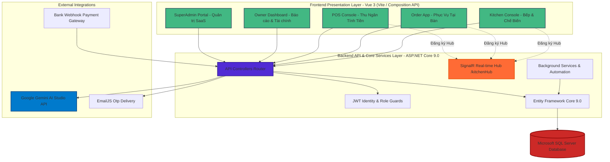
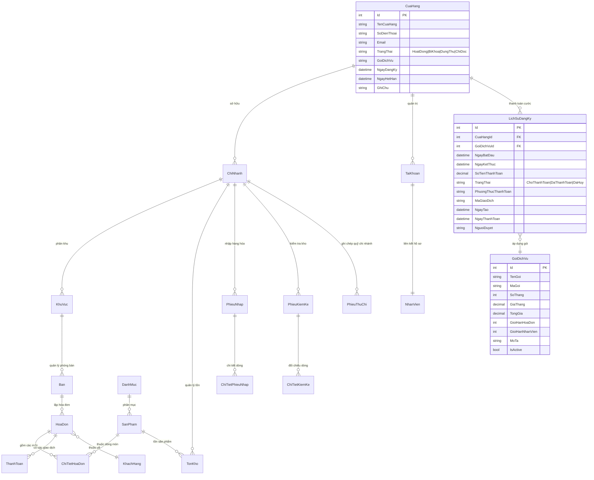
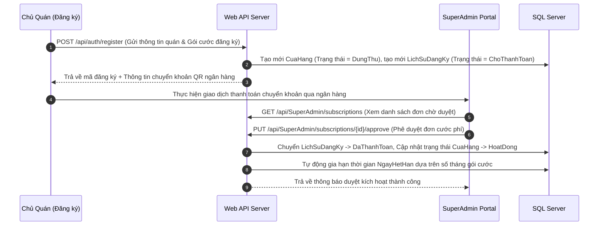

<div align="center">

```
 ██████╗  ██████╗  ██████╗ ██████╗  ██████╗ 
 ██╔══██╗██╔═══██╗██╔════╝ ╚════██╗ ██╔════╝ 
 ██████╔╝██║   ██║╚█████╗   █████╔╝ ███████╗ 
 ██╔═══╝ ██║   ██║ ╚═══██╗  ╚═══██╗ ██╔═══██╗
 ██║     ╚██████╔╝██████╔╝ ██████╔╝ ╚██████╔╝
 ╚═╝      ╚═════╝ ╚═════╝  ╚═════╝   ╚═════╝ 
```

# 🍽️ POS36 — Hệ Thống Quản Lý Bán Hàng F&B & Nền Tảng SaaS Đa Chi Nhánh

**Giải pháp Point of Sale (POS) toàn diện · Quản trị Chuỗi Cửa hàng F&B · Nền tảng SaaS Cloud-Native · Hệ thống Trợ lý AI Phân quyền thông minh**

[](https://dotnet.microsoft.com/)
[](https://vuejs.org/)
[](https://www.microsoft.com/sql-server)
[](https://dotnet.microsoft.com/apps/aspnet/signalr)
[](https://ai.google.dev/)
[](https://www.docker.com/)

[🚀 Bắt Đầu Nhanh](#-hướng-dẫn-khởi-động-nhanh) · [📖 Mục Lục](#-mục-lục) · [🎯 Tính Năng](#-tính-năng-nổi-bật) · [🏗️ Kiến Trúc](#-kiến-trúc-hệ-thống) · [🤖 AI Copilot](#-kiến-trúc-trợ-lý-ai-phân-quyền)

</div>

---

## 📋 Mục Lục

- [1. Giới Thiệu Dự Án](#1-giới-thiệu-dự-án)
- [2. Tính Năng Nổi Bật](#2-tính-năng-nổi-bật)
- [3. Kiến Trúc Trợ Lý AI Phân Quyền (AI Copilot Engine)](#3-kiến-trúc-trợ-lý-ai-phân-quyền-ai-copilot-engine)
  - [3.1. Phân Phối File Prompts & Vai Trò AI](#31-phân-phối-file-prompts--vai-trò-ai)
  - [3.2. Cơ Chế Gọi Hàm (Function Calling) & Phê Duyệt An Toàn](#32-cơ-chế-gọi-hàm-function-calling--phê-duyệt-an-toàn)
  - [3.3. Tự Động Kết Xuất Báo Cáo HTML Động](#33-tự-động-kết-xuất-báo-cáo-html-động)
- [4. Kiến Trúc Hệ Thống & Realtime Hub](#4-kiến-trúc-hệ-thống--realtime-hub)
- [5. Mô Hình Cơ Sở Dữ Liệu (ERD) & SaaS Multi-Tenant](#5-mô-hình-cơ-sở-dữ-liệu-erd--saas-multi-tenant)
- [6. Giao Diện Nghiệp Vụ Sử Dụng (Use Cases)](#6-giao-diện-nghiệp-vụ-sử-dụng-use-cases)
- [7. Hướng Dẫn Khởi Động Nhanh](#7-hướng-dẫn-khởi-động-nhanh)
  - [7.1. Cài Đặt Nhanh Với Docker](#71-cài-đặt-nhanh-với-docker)
  - [7.2. Cài Đặt Thủ Công](#72-cài-đặt-thủ-công)
  - [7.3. Các Tập Tin Hỗ Trợ Khởi Động Nhanh (Windows Batch Scripts)](#73-các-tập-tin-hỗ-trợ-khởi-động-nhanh-windows-batch-scripts)
- [8. Bản Đồ API Chi Tiết (API Documentation)](#8-bản-đồ-api-chi-tiết-api-documentation)
- [9. Ma Trận Phân Quyền (RBAC Security)](#9-ma-trận-phân-quyền-rbac-security)
- [10. Luồng Nghiệp Vụ Cốt Lõi (System Workflows)](#10-luồng-nghiệp-vụ-cốt-lõi-system-workflows)
- [11. Thông Tin Nhóm Phát Triển](#11-thông-tin-nhóm-phát-triển)

---

## 1. Giới Thiệu Dự Án

**POS36** là một hệ sinh thái quản lý bán hàng chuyên nghiệp, hiện đại, tối ưu cho mô hình ngành hàng **F&B (Nhà hàng, Quán ăn, Chuỗi cà phê)**. Hệ thống vận hành theo kiến trúc **SaaS (Software-as-a-Service)** đa khách thuê (Multi-tenant), hỗ trợ quản lý đa chi nhánh, phân tách dữ liệu an toàn và đồng bộ hóa thời gian thực tuyệt đối.

Điểm đột phá vượt trội của POS36 là việc tích hợp **Hệ thống AI Copilot** thông minh sử dụng mô hình **Gemini 3.1 Flash Lite** thế hệ mới (2026), có khả năng đọc hiểu trực tiếp cấu trúc database, tự động sinh mã báo cáo tương tác HTML trực quan, và thay mặt Quản trị viên (SuperAdmin) thực hiện các thao tác hệ thống nâng cao thông qua cơ chế phê duyệt bảo mật an toàn.

---

## 2. Tính Năng Nổi Bật

### 🏪 Mô Hình SaaS Multi-Tenant Thực Thụ
* **Độc Lập Dữ Liệu:** Mỗi thương hiệu đăng ký là một Tenant độc lập (`CuaHangId`), sở hữu phân vùng dữ liệu riêng về sơ đồ phòng bàn, nhân sự, thực đơn, khách hàng, kho bãi và dòng tiền.
* **Thời Hạn & Gói Cước:** Hệ thống tự động quản lý chu kỳ sống của cửa hàng thông qua 4 trạng thái linh hoạt:
  * `DungThu` (Trial): Giới hạn thời gian dùng thử và tài nguyên cấu hình.
  * `HoatDong` (Active): Đã kích hoạt đầy đủ tính năng sau khi thanh toán gói cước thành công.
  * `ChiDoc` (ReadOnly): Chế độ hết hạn cước phí, tạm khóa các tính năng chỉnh sửa dữ liệu, bán hàng nhưng vẫn cho phép đọc và xuất dữ liệu cũ.
  * `BiKhoa` (Blocked): Tạm dừng hoạt động hoàn toàn do vi phạm chính sách hoặc yêu cầu đặc biệt.
* **Giới Hạn Thông Minh:** Ràng buộc chặt chẽ số lượng hóa đơn phát sinh hàng tháng (`GioiHanHoaDon`) và số lượng nhân sự tạo mới (`GioiHanNhanVien`) theo hạn mức của từng Gói dịch vụ (`GoiDichVu`).

### 📡 Đồng Bộ Hóa Thời Gian Thực (SignalR Real-time Hub)
* **Luồng Đơn Hàng Không Trễ:** Nhân viên Phục vụ gọi món trên máy tính bảng/điện thoại di động -> Bếp nhận ngay yêu cầu chế biến lập tức mà không cần tải lại trang.
* **Bảng Sơ Đồ Trạng Thái:** Cập nhật ngay tức khắc trạng thái bàn ăn (Bàn Trống, Đang Có Khách, Đang Chờ Chế Biến, Đợi Thanh Toán) trên toàn bộ thiết bị của Nhân viên Phục vụ và Thu ngân.
* **Thông Báo Sự Kiện:** SuperAdmin và Chủ cửa hàng nhận được cảnh báo trực quan khi có giao dịch thanh toán lớn hoặc gói đăng ký mới cần duyệt.

### 💰 Quản Lý Kho & Sổ Quỹ Tài Chính Chặt Chẽ
* **Trừ Kho Tự Động:** Tự động đối trừ số lượng tồn kho nguyên vật liệu ngay khi Thu ngân in hóa đơn bán hàng thành công.
* **Phiếu Nhập/Kiểm Kho:** Quy trình lập phiếu nhập hàng nhà cung cấp và biên bản kiểm kê định kỳ khoa học, theo dõi chênh lệch hao hụt thực tế.
* **Sổ Quỹ Sổ Sách:** Tự động sinh **Phiếu Thu** khi hoàn tất hóa đơn bán hàng và sinh **Phiếu Chi** khi hoàn tất thanh toán phiếu nhập kho, giúp ngăn ngừa thất thoát ngân quỹ.

### 💳 QR Code Động & Webhook Ngân Hàng
* **Thanh Toán Không Tiền Mặt:** Tự tạo mã **QR Code động** (chứa đầy đủ thông tin số tài khoản, tên chủ thẻ, số tiền chính xác và nội dung giao dịch duy nhất) cho mỗi hóa đơn.
* **Webhook Đồng Bộ:** Tích hợp cổng thanh toán trực tuyến tự động kích hoạt trạng thái "Đã thanh toán" ngay khi dòng tiền thực đổ về tài khoản ngân hàng của cửa hàng.

---

## 3. Kiến Trúc Trợ Lý AI Phân Quyền (AI Copilot Engine)

Hệ thống POS36 không chỉ có một chatbot AI đơn giản, mà sở hữu một **Động Cơ AI Copilot phân quyền sâu sắc**, được cấu hình đặc biệt thông qua các tệp chỉ thị Prompt đặt trong thư mục `POS36.Api/Prompts/`.

```
                  ┌─────────────────────────────────┐
                  │   Giao Diện Chatbot AI (UI)     │
                  └────────────────┬────────────────┘
                                   │
                    [Tự động đính kèm Vai trò & JWT]
                                   ▼
                  ┌─────────────────────────────────┐
                  │    Tải Tệp Prompt tương ứng     │
                  │       (Từ /Prompts/*.md)        │
                  └────────────────┬────────────────┘
                                   │
                        [Nạp Cấu Trúc Database]
                                   ▼
                  ┌─────────────────────────────────┐
                  │    Gemini 3.1 Flash Lite API    │
                  └────────────────┬────────────────┘
                                   │
                      [Lựa chọn luồng xử lý]
            ┌──────────────────────┴──────────────────────┐
            ▼ (Function Calling)                          ▼ (Quy tắc hiển thị)
 ┌──────────────────────┐                       ┌──────────────────────┐
 │ Đề xuất Gọi Hàm Tool │                       │ Sinh Mã Báo Cáo HTML │
 └──────────┬───────────┘                       └──────────┬───────────┘
            │                                              │
   [Xác thực Bảo mật]                                      │ (Nhúng Inline CSS)
            ▼                                              ▼
 ┌──────────────────────┐                       ┌──────────────────────┐
 │  Hộp thoại Phê Duyệt │                       │ Hiển thị Dashboard   │
 │   trên Giao Diện UI  │                       │   AI Report Đẹp Mắt  │
 └──────────────────────┘                       └──────────────────────┘
```

### 3.1. Phân Phối File Prompts & Vai Trò AI

Mỗi phân quyền tài khoản khi đăng nhập sẽ được kết nối với một AI Agent riêng biệt, đảm bảo tính bảo mật và sự phù hợp trong giao tiếp nghiệp vụ:

| Tên File Prompt | Vai Trò AI (Persona) | Phạm Vi Hoạt Động & Quyền Hạn | Giới Hạn Hạn Chế |
| :--- | :--- | :--- | :--- |
| [`SuperAdmin_Agent.md`](file:///d:/CSharp/ASP.NET/POS36/POS36.Api/POS36.Api/Prompts/SuperAdmin_Agent.md) | **POS36 AI Agent tối cao** | Toàn quyền kiểm soát hệ thống SaaS; truy vấn thông tin toàn bộ các quán; khóa/mở khóa cửa hàng; gia hạn thời hạn gói cước; điều chỉnh cấu hình toàn cục hệ thống. | Không được phép tự ý sửa đổi Database trực tiếp nếu không qua lớp Tool API của ứng dụng. |
| [`ReportCopilot.md`](file:///d:/CSharp/ASP.NET/POS36/POS36.Api/POS36.Api/Prompts/ReportCopilot.md) | **Chuyên gia Phân tích Dữ liệu** | Tập trung phân tích dữ liệu kinh doanh thô thu được từ SQL Server, lập biểu đồ, grid cards thống kê chi tiết. | Chỉ thực hiện các tác vụ đọc dữ liệu phân tích, không có quyền can thiệp hệ thống. |
| [`Chat_QuanLy.md`](file:///d:/CSharp/ASP.NET/POS36/POS36.Api/POS36.Api/Prompts/Chat_QuanLy.md) | **Cộng sự & Cố vấn Chiến lược** | Hỗ trợ đắc lực cho Quản lý và Chủ cửa hàng; hướng dẫn cấu hình thực đơn, sơ đồ bàn; phân tích doanh thu chi nhánh, cảnh báo tồn kho, gợi ý chiến dịch up-selling/cross-selling tăng trưởng. | Chỉ giới hạn thông tin thuộc phạm vi Tenant của mình, xưng hô thân thiện ("Tớ" - "Sếp"). |
| [`Chat_ThuNgan.md`](file:///d:/CSharp/ASP.NET/POS36/POS36.Api/POS36.Api/Prompts/Chat_ThuNgan.md) | **Trợ lý Thu ngân Tỉ mỉ** | Hướng dẫn thu ngân thao tác nhanh: ghép bàn, tách bill, gộp bàn, áp mã giảm giá, kiểm soát dòng tiền mặt ca trực chuẩn xác. | Chỉ xem được báo cáo doanh thu cục bộ trong ca làm việc, không được xem tài chính dài hạn của cửa hàng. |
| [`Chat_Order.md`](file:///d:/CSharp/ASP.NET/POS36/POS36.Api/POS36.Api/Prompts/Chat_Order.md) | **Cộng sự Phục vụ Thân thiện** | Hỗ trợ nhân viên phục vụ mở bàn nhanh, ghi chú món ăn đặc biệt (không hành, ít ngọt...), hướng dẫn thao tác POS cầm tay. | Bị chặn hoàn toàn quyền xem thông tin doanh thu, sổ quỹ và tồn kho của cửa hàng. |

---

### 3.2. Cơ Chế Gọi Hàm (Function Calling) & Phê Duyệt An Toàn

Đối với các tác vụ thuộc quyền hạn của `SuperAdmin_Agent.md` có tính chất nhạy cảm hoặc rủi ro cao (như **Khóa Cửa Hàng**, **Gia Hạn Gói Cước**, **Thiết Lập Hệ Thống**), POS36 áp dụng cơ chế bảo mật **Human-in-the-loop (Con người phê duyệt)**:

1. AI Agent phân tích ý định của SuperAdmin (Ví dụ: *"Khóa tài khoản của cửa hàng Highland Coffee do quá hạn thanh toán"*).
2. AI đề xuất gọi hàm `KhoaCuaHang` kèm tham số `cuaHangId: 12`, `lyDo: "Quá hạn thanh toán"`.
3. Hệ thống chặn lệnh thực thi trực tiếp, chuyển tiếp đề xuất lên giao diện Vue 3 dưới dạng **Hộp thoại xác thực hành động của AI** (AI Confirmation Dialog).
4. SuperAdmin nhấn **"Phê Duyệt"** (Approve) -> Backend API mới thực thi thay đổi trong database và ghi nhận chi tiết vào `NhatKyHeThong` (`AIThucThi`). Nếu SuperAdmin nhấn **"Hủy"** -> AI hủy bỏ lệnh và ghi nhận trạng thái (`AIHuyLenh`).

---

### 3.3. Tự Động Kết Xuất Báo Cáo HTML Động

Thay vì hiển thị các khối văn bản markdown đơn điệu, AI Copilot của POS36 được thiết kế để tự động chuyển hóa dữ liệu JSON thô nhận được từ cơ sở dữ liệu thành các báo cáo giao diện trực quan cực đẹp:
* **Giao Diện Chuyên Dụng (Dark Theme):** Sử dụng các tông màu tối hiện đại (`#0f1117`, text `#e4e4e7`, accent `#f59e0b`).
* **Trực Quan Hóa Đa Dạng:** Tự động lựa chọn mô hình hiển thị tối ưu:
  * **Stat Cards Grid:** Cho báo cáo tổng quan tài chính.
  * **Interactive Table:** Cho danh sách hóa đơn, khách hàng hoặc tồn kho nguyên liệu.
  * **Rank Badges:** Cho danh sách món ăn bán chạy nhất (Top Sellers).
* **Tối Ưu Trải Nghiệm Mượt Mà:** Sử dụng cơ chế lọc Axios Interceptor chuyên dụng để vô hiệu hóa màn hình Loading Overlay xoay tròn khi đang trò chuyện với AI, giúp quá trình trò chuyện đa bước diễn ra trơn tru mà không làm gián đoạn tiến trình công việc của người dùng.

---

## 4. Kiến Trúc Hệ Thống & Realtime Hub

Dự án POS36 được phát triển theo kiến trúc tách biệt hoàn hảo giữa Frontend SPA và RESTful Web API Backend:



---

## 5. Mô Hình Cơ Sở Dữ Liệu (ERD) & SaaS Multi-Tenant

Cơ sở dữ liệu được tổ chức chặt chẽ nhằm tối ưu hóa mối quan hệ giữa các Tenant (Cửa hàng) và các hoạt động vận hành chi tiết:



### Các Phân Hệ Cơ Sở Dữ Liệu Chính:
1. **Phân Hệ SaaS Multi-Tenant:**
   * `CuaHang`: Bảng trọng tâm lưu giữ vòng đời của từng Tenant, trạng thái hoạt động, ngày bắt đầu và ngày hết hạn dịch vụ.
   * `GoiDichVu`: Định nghĩa các hạn mức kỹ thuật (số nhân viên tối đa, số hóa đơn tối đa/tháng) và biểu phí dịch vụ F&B.
   * `LichSuDangKy`: Lịch sử đóng phí, gia hạn dịch vụ, hỗ trợ đối soát mã giao dịch (`MaGiaoDich`).
2. **Phân Hệ Vận Hành Bán Hàng (POS Core):**
   * `ChiNhanh`, `KhuVuc`, `Ban`: Quản lý sơ đồ mặt bằng chi tiết của cửa hàng.
   * `DanhMuc`, `SanPham`: Thực đơn số, lưu trữ hình ảnh món ăn, giá bán và công thức định lượng nếu có.
   * `HoaDon`, `ChiTietHoaDon`, `ThanhToan`: Theo dõi chi tiết mọi giao dịch bán hàng, phương thức thanh toán phát sinh.
3. **Phân Hệ Kho Bãi & Quản Lý Sổ Quỹ Dòng Tiền:**
   * `TonKho`: Số lượng tồn kho thực tế của các mặt hàng/nguyên vật liệu phân theo từng chi nhánh cụ thể.
   * `PhieuNhap`, `ChiTietPhieuNhap`: Theo dõi hóa đơn mua hàng từ nhà cung cấp, cập nhật giá vốn và công nợ.
   * `PhieuKiemKe`, `ChiTietKiemKe`: Xử lý chênh lệch tồn kho thực tế và tồn kho trên hệ thống.
   * `PhieuThuChi`: Quản lý dòng tiền vào/ra (Sổ Quỹ). Đảm bảo tính minh bạch thông qua việc tự động sinh **Phiếu Thu** (từ Doanh thu Hóa đơn bán hàng) và **Phiếu Chi** (từ chi phí Nhập hàng).

---

## 6. Giao Diện Nghiệp Vụ Sử Dụng (Use Cases)

```mermaid
graph TB
    subgraph "Các Vai Trò Hệ Thống (Roles)"
        SAD[SuperAdmin Hệ Thống]
        CCH[Chủ Cửa Hàng]
        QL[Quản Lý Chi Nhánh]
        TN[Thu Ngân POS]
        PV[Phục Vụ Bàn]
        BEP[Bếp Chế Biến]
    end
    
    subgraph "Cổng Quản Trị Hệ Thống SaaS"
        UC1[Giám sát SaaS Dashboard]
        UC2[Duyệt yêu cầu gia hạn gói]
        UC3[Khóa / Mở khóa Tenant]
        UC4[Hội thoại AI Agent điều phối]
    end
    
    subgraph "Nghiệp Vụ Bán Hàng & POS"
        UC5[Thiết lập sơ đồ bàn ăn]
        UC6[Mở bàn & Gọi món nhanh]
        UC7[Ghép bàn / Chuyển bàn]
        UC8[Nhận chế biến - Báo hoàn tất]
        UC9[Tính tiền - In hóa đơn - Thanh toán QR]
    end
    
    subgraph "Hệ Thống Kho Bãi & Sổ Quỹ"
        UC10[Lập phiếu nhập kho]
        UC11[Kiểm kê kho thực tế]
        UC12[Quản lý Sổ quỹ thu chi]
        UC13[AI Phân tích insights kinh doanh]
    end
    
    SAD --> UC1
    SAD --> UC2
    SAD --> UC3
    SAD --> UC4
    
    CCH --> UC12
    CCH --> UC13
    
    QL --> UC5
    QL --> UC10
    QL --> UC11
    
    PV --> UC6
    PV --> UC7
    
    BEP --> UC8
    
    TN --> UC9
```



---

## 7. Hướng Dẫn Khởi Động Nhanh

### 7.1. Cài Đặt Nhanh Với Docker

Đây là phương thức cài đặt nhanh nhất, tự động thiết lập toàn bộ môi trường cơ sở dữ liệu SQL Server, Web API Backend, và Vue 3 Frontend chỉ với một dòng lệnh.

#### Yêu Cầu Chuẩn Bị:
* Đã cài đặt **Docker Desktop** (cho Windows/macOS) hoặc **Docker Engine** (cho Linux).
* RAM trống: Tối thiểu 4GB.

#### Các Bước Thực Hiện:

1. **Tải mã nguồn về máy tính cá nhân:**
   ```bash
   git clone https://github.com/Nhanduc2912/POS36.git
   cd POS36
   ```

2. **Khởi chạy hệ thống Container:**
   ```bash
   docker-compose up -d
   ```

3. **Nạp Cấu Trúc Cơ Sở Dữ Liệu & Dữ Liệu Mẫu:**
   Đợi khoảng 30 giây để SQL Server Docker khởi động hoàn toàn. Sau đó, sao chép tệp SQL dữ liệu mẫu vào container và chạy lệnh thiết lập cơ sở dữ liệu:
   
   * **Bước A: Sao chép tệp SQL vào container database:**
     ```bash
     docker cp POS36_DATA.sql pos36-db:/POS36_DATA.sql
     ```
   * **Bước B: Khởi chạy lệnh nạp dữ liệu:**
     * **Dành cho Windows PowerShell:**
       ```powershell
       docker exec -it pos36-db /opt/mssql-tools/bin/sqlcmd -S localhost -U sa -P "Pos36_Secret_Password_123!" -i /POS36_DATA.sql
       ```
     * **Dành cho Linux / macOS Terminal:**
       ```bash
       docker exec -it pos36-db /opt/mssql-tools/bin/sqlcmd -S localhost -U sa -P 'Pos36_Secret_Password_123!' -i /POS36_DATA.sql
       ```

4. **Truy Cập Ứng Dụng:**
   * **Giao diện Web (Frontend):** [http://localhost:3000](http://localhost:3000)
   * **Đường dẫn Web API Gateway:** [http://localhost:5098](http://localhost:5098)
   * **Trang tài liệu Swagger UI:** [http://localhost:5098/swagger](http://localhost:5098/swagger)

---

### 7.2. Cài Đặt Thủ Công Trên Windows

Nếu bạn muốn chạy trực tiếp trên hệ điều hành Windows mà không sử dụng Docker, vui lòng thực hiện tuần tự theo các bước chi tiết sau:

#### Bước 1: Yêu Cầu Cài Đặt Trước (Prerequisites)
1. **.NET 9.0 SDK:** Tải và cài đặt tại [.NET 9.0 SDK](https://dotnet.microsoft.com/download/dotnet/9.0).
2. **Node.js:** Tải phiên bản LTS (v18 trở lên) tại [Node.js](https://nodejs.org/).
3. **Microsoft SQL Server (2019 trở lên):** Tải bản Express hoặc Developer tại [SQL Server Downloads](https://www.microsoft.com/sql-server/sql-server-downloads).
4. **Công cụ Quản trị Database (SSMS):** Khuyến nghị cài đặt [SQL Server Management Studio (SSMS)](https://learn.microsoft.com/sql/ssms/download-sql-server-management-studio-ssms) để dễ dàng thao tác trực quan.

#### Bước 2: Thiết Lập Connection String
1. Mở tệp [`appsettings.json`](file:///home/ducnguyener/POS36/POS36.Api/POS36.Api/appsettings.json) trong thư mục `POS36.Api/POS36.Api/`.
2. Thay đổi giá trị chuỗi kết nối `DefaultConnection` tùy theo kiểu cấu hình SQL Server trên máy bạn:
   * **SQL Express (Sử dụng Windows Authentication - Khuyên dùng):**
     ```json
     "ConnectionStrings": {
       "DefaultConnection": "Server=localhost\\SQLEXPRESS;Database=POS36_Db;Trusted_Connection=True;TrustServerCertificate=True;"
     }
     ```
   * **SQL Server (Sử dụng tài khoản SA / SQL Server Authentication):**
     ```json
     "ConnectionStrings": {
       "DefaultConnection": "Server=localhost;Database=POS36_Db;User Id=sa;Password=MatKhauCuaBan;TrustServerCertificate=True;"
     }
     ```
   * **LocalDB (Mặc định khi cài đặt Visual Studio):**
     ```json
     "ConnectionStrings": {
       "DefaultConnection": "Server=(localdb)\\mssqllocaldb;Database=POS36_Db;Trusted_Connection=True;TrustServerCertificate=True;"
     }
     ```

#### Bước 3: Hướng Dẫn Entity Framework Core Migrations
Hệ thống sử dụng EF Core Code-First để quản lý cơ sở dữ liệu. Làm theo hướng dẫn sau để cài đặt công cụ, tạo migration mới và cập nhật cấu trúc database:

1. **Cài đặt công cụ EF Core CLI:**
   Mở Command Prompt hoặc PowerShell và chạy lệnh cài đặt toàn cục (nếu máy bạn chưa có sẵn):
   ```bash
   dotnet tool install --global dotnet-ef
   ```
   *(Để nâng cấp phiên bản cũ lên phiên bản mới nhất, sử dụng lệnh: `dotnet tool update --global dotnet-ef`)*

2. **Cách tạo một Migration mới (Khi bạn thay đổi code Model/Entities):**
   Mở Terminal tại thư mục gốc của dự án và chạy:
   ```bash
   dotnet ef migrations add <TenMigrationCuaBan> --project POS36.Api --startup-project POS36.Api
   ```
   *(Ví dụ: `dotnet ef migrations add AddNewTable`)*

3. **Áp dụng các Migration hiện tại để sinh cấu trúc bảng (Database Update):**
   Chạy lệnh sau để EF Core tự động tạo CSDL `POS36_Db` (nếu chưa tồn tại) và tự động thiết lập toàn bộ cấu trúc bảng (tables, keys, indexes):
   ```bash
   dotnet ef database update --project POS36.Api --startup-project POS36.Api
   ```

#### Bước 4: Khởi Tạo Dữ Liệu Mẫu (Database Seeding)
Sau khi đã sinh cấu trúc database thành công từ Bước 3, bạn cần import dữ liệu mẫu ban đầu từ tệp [`POS36_DATA.sql`](file:///home/ducnguyener/POS36/POS36_DATA.sql) nằm ở thư mục gốc của dự án.

* **Cách 1: Sử dụng SQL Server Management Studio (SSMS)**
  1. Mở SSMS và kết nối đến SQL Server.
  2. Chọn **File -> Open -> File...** và tìm mở tệp `POS36_DATA.sql` ở thư mục gốc của dự án.
  3. Đảm bảo dòng đầu tiên của file SQL ghi đúng tên database của bạn: `USE [POS36_Db]`.
  4. Nhấp nút **Execute** (hoặc nhấn phím **F5**) để chạy toàn bộ script.

* **Cách 2: Sử dụng dòng lệnh (sqlcmd)**
  Mở Command Prompt/PowerShell và thực hiện lệnh import trực tiếp:
  * *Nếu sử dụng Windows Authentication:*
    ```cmd
    sqlcmd -S localhost\SQLEXPRESS -d POS36_Db -i POS36_DATA.sql
    ```
  * *Nếu sử dụng tài khoản SA:*
    ```cmd
    sqlcmd -S localhost\SQLEXPRESS -U sa -P "MatKhauCuaBan" -d POS36_Db -i POS36_DATA.sql
    ```

#### Bước 5: Chạy Ứng Dụng Bằng Dòng Lệnh
* **Chạy Backend Web API:**
  1. Mở Terminal mới, điều hướng vào thư mục API:
     ```bash
     cd POS36.Api/POS36.Api
     ```
  2. Cấu hình khóa Google Gemini API Key trong `appsettings.json` (tùy chọn để kích hoạt AI Copilot).
  3. Khởi chạy Backend:
     ```bash
     dotnet run
     ```
     *(Backend hoạt động tại: `http://localhost:5098`)*

* **Chạy Frontend Vue 3:**
  1. Mở một Terminal khác, chuyển tới thư mục Frontend:
     ```bash
     cd POS36.Web
     ```
  2. Cài đặt các thư viện bổ sung:
     ```bash
     npm install
     ```
  3. Khởi chạy máy chủ phát triển (Dev server):
     ```bash
     npm run dev
     ```
     *(Frontend hoạt động tại: `http://localhost:5173`)*

---

### 7.3. Các Tập Tin Hỗ Trợ Khởi Động Nhanh (Windows Batch Scripts)

Để tối ưu hóa quy trình khởi động và cài đặt trên Windows, dự án cung cấp bộ công cụ batch scripts tự động trong thư mục `scripts/`:

* **`scripts\setup.bat` (Thiết lập tự động lần đầu):** 
  Tự động kiểm tra môi trường .NET SDK và Node.js; tự động khôi phục dependencies (`dotnet restore` & `npm install`) và cấu hình sẵn tệp môi trường `.env` cho Frontend.
  * *Cách chạy:* Click chuột phải vào tệp và chọn **"Run as Administrator"**.
* **`scripts\run.bat` (Khởi chạy đồng thời):**
  Tự động quét dọn các tiến trình chạy ngầm cũ đang chiếm dụng cổng, sau đó tự khởi động cả Backend và Frontend cùng một lúc.
  * *Cách chạy:* Click đúp chuột trái vào tệp.
* **`scripts\stop.bat` (Dừng hệ thống):**
  Dừng ngay lập tức toàn bộ các tiến trình dotnet và node đang chạy ngầm để giải phóng tài nguyên hệ thống.
  * *Cách chạy:* Click đúp chuột trái vào tệp.
* **`scripts\build.bat` (Đóng gói Production):**
  Hỗ trợ build và đóng gói toàn bộ mã nguồn Backend/Frontend sẵn sàng đem đi triển khai thực tế.


---

## 8. Bản Đồ API Chi Tiết (API Documentation)

Hệ thống cung cấp hệ thống RESTful API chuẩn hóa, bảo mật bằng Token JWT. Mọi yêu cầu API (trừ luồng Đăng ký/Đăng nhập) đều phải đính kèm Header:
`Authorization: Bearer <JWT_TOKEN_CỦA_BẠN>`

```
🌐 [Client APP] ──(JWT Token)──> [JWT Guard Middleware] ──(Hợp Lệ)──> [Business Controllers]
```

### 1️⃣ Nhóm API Đăng Ký / Đăng Nhập (`/api/auth`)
* `POST /api/auth/register`: Đăng ký tài khoản thương hiệu mới, tự động khởi tạo Tenant SaaS ở trạng thái `DungThu` và tạo tài khoản quản trị tối cao ban đầu của shop.
* `POST /api/auth/login`: Xác thực thông tin người dùng, trả về thông tin Tenant, phân quyền (`VaiTro`) và mã **Token JWT** mã hóa.

### 2️⃣ Nhóm API Nghiệp Vụ Bán Hàng POS (`/api/hoadon`)
* `POST /api/hoadon/goimon`: Nhận chi tiết danh sách món ăn từ bàn phục vụ, lập tức kích hoạt sự kiện SignalR gửi thông báo chế biến xuống màn hình nhà Bếp.
* `GET /api/hoadon/pending`: Thu thập danh sách hóa đơn chưa thanh toán thuộc Tenant hiện tại phục vụ công tác thanh toán.
* `POST /api/hoadon/thanhtoan/{banId}`: Kết toán hóa đơn, trừ số lượng tồn kho nguyên vật liệu tương ứng, kích hoạt tạo tự động **Phiếu Thu** tài chính và in hóa đơn thanh toán.

### 3️⃣ Nhóm API Trợ Lý Trí Tuệ Nhân Tạo AI (`/api/aichat`)
* `POST /api/aichat/chat`: Giao tiếp đa bước với AI Agent. Backend sẽ tự động phân tích vai trò của tài khoản thực hiện để áp dụng tệp Prompt tương ứng trong `/Prompts/*.md`.
* `POST /api/aichat/report`: Trích xuất dữ liệu thực tế trong SQL Server và gửi trực tiếp tới Gemini 3.1 Flash Lite để sinh mã báo cáo HTML tương tác chuyên sâu.
* `POST /api/aichat/confirm`: API phê duyệt hoặc từ chối hành động nguy cơ cao do AI đề xuất. Khi được phê duyệt, lệnh sẽ chính thức thực thi trong CSDL và ghi log hệ thống.
* `GET /api/aichat/models`: Lấy danh sách các dòng mô hình AI đang được hỗ trợ kết nối trực tiếp với tài khoản Google AI Studio.

---

## 9. Ma Trận Phân Quyền (RBAC Security)

Hệ thống bảo mật nghiêm ngặt thông qua cơ chế kiểm soát quyền truy cập dựa trên vai trò (Role-Based Access Control - RBAC). Dưới đây là bảng ma trận quyền hạn chi tiết:

| Tính Năng Nghiệp Vụ | SuperAdmin | Chủ Cửa Hàng | Quản Lý | Thu Ngân | Phục Vụ | Bếp |
| :--- | :---: | :---: | :---: | :---: | :---: | :---: |
| **Cấu hình hệ thống SaaS** | ✅ | ❌ | ❌ | ❌ | ❌ | ❌ |
| **Phê duyệt đơn đăng ký/Gia hạn** | ✅ | ❌ | ❌ | ❌ | ❌ | ❌ |
| **Khóa / Mở khóa các Tenant** | ✅ | ❌ | ❌ | ❌ | ❌ | ❌ |
| **Hội thoại AI Agent Tối Cao** | ✅ | ❌ | ❌ | ❌ | ❌ | ❌ |
| **Quản lý chuỗi chi nhánh & Nhân sự** | ❌ | ✅ | ❌ | ❌ | ❌ | ❌ |
| **Quản lý kho nguyên vật liệu** | ❌ | ✅ | ✅ | ❌ | ❌ | ❌ |
| **Thiết lập sơ đồ phòng bàn** | ❌ | ✅ | ✅ | ❌ | ❌ | ❌ |
| **Xem Sổ Quỹ Thu Chi** | ❌ | ✅ | ✅ | ❌ | ❌ | ❌ |
| **Thực hiện bán hàng POS & Tính tiền** | ❌ | ✅ | ✅ | ✅ | ❌ | ❌ |
| **Mở bàn & Gọi món (Order)** | ❌ | ✅ | ✅ | ✅ | ✅ | ❌ |
| **Chế biến & Báo hoàn tất món ăn** | ❌ | ❌ | ❌ | ❌ | ❌ | ✅ |

---

## 10. Luồng Nghiệp Vụ Cốt Lõi (System Workflows)

### A. Luồng Đăng Ký & Kích Hoạt Cửa Hàng SaaS



### B. Luồng Gọi Món & Chế Biến Realtime

```mermaid
sequenceDiagram
    autonumber
    participant PV as Phục Vụ (Order App)
    participant API as Web API Server
    participant Hub as SignalR kitchenHub
    participant Bep as Màn Hình Bếp
    participant TN as Thu Ngân (POS)
    
    PV->>API: POST /api/hoadon/goimon (Mở bàn, chọn món, số lượng, ghi chú)
    API->>DB: Lưu dữ liệu vào HoaDon, ChiTietHoaDon; cập nhật Ban sang trạng thái ĐangCóKhách
    API->>Hub: Kích hoạt thông điệp Phát Sóng (Broadcast Event)
    Hub-->>Bep: Truyền lệnh real-time (CoDonHangMoi)
    Bep->>Bep: Giao diện tự động thêm món mới vào hàng đợi, phát chuông cảnh báo
    Bep->>API: PUT /api/hoadon/bep/xong/{chiTietId} (Hoàn tất chế biến dòng món)
    API->>Hub: Kích hoạt thông điệp Phát Sóng món hoàn thành
    Hub-->>PV: Gửi thông báo tới thiết bị Phục Vụ mang món ra bàn cho khách
    Hub-->>TN: Đồng bộ tức thì hóa đơn sẵn sàng thanh toán ở quầy thu ngân
```

---

## 11. Thông Tin Nhóm Phát Triển

* **Tác giả:** Nguyễn Nhân Đức
* **Trường đào tạo:** FPT Polytechnic
* **Môn chuyên ngành:** Phát triển ứng dụng tích hợp (.NET)
* **Thư điện tử:** [nhanduc29122008@gmail.com](mailto:nhanduc29122008@gmail.com)
* **Kênh mã nguồn Dự án:** [GitHub Nhanduc2912/POS36](https://github.com/Nhanduc2912/POS36)
* **Giấy phép bản quyền:** Phân phối và phát triển tự do dưới giấy phép mã nguồn mở **MIT License**.

---

<div align="center">

**Made with ❤️ — FPT Polytechnic | Môn: Phát triển ứng dụng (.Net)**

[GitHub](https://github.com/Nhanduc2912/POS36) · [Email](mailto:nhanduc29122008@gmail.com)

[⬆ Quay lại đầu trang](#🍽️-pos36--hệ-thống-quản-lý-bán-hàng-fb--nền-tảng-saas-đa-chi-nhánh)

</div>
