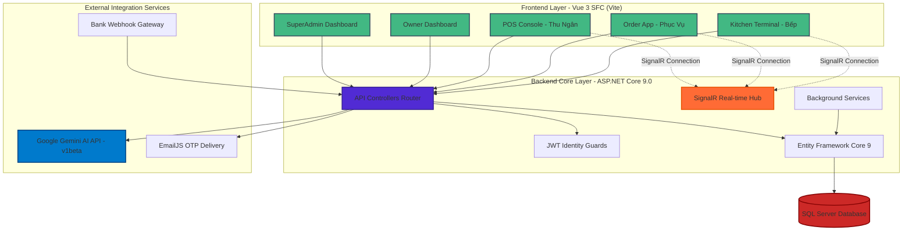
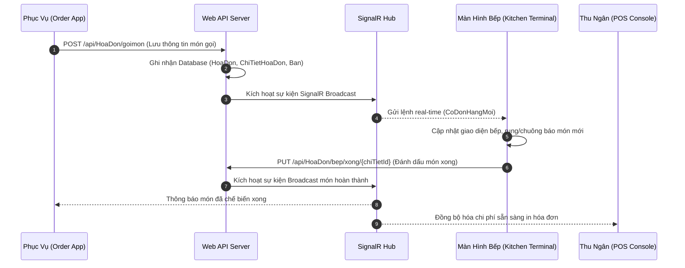
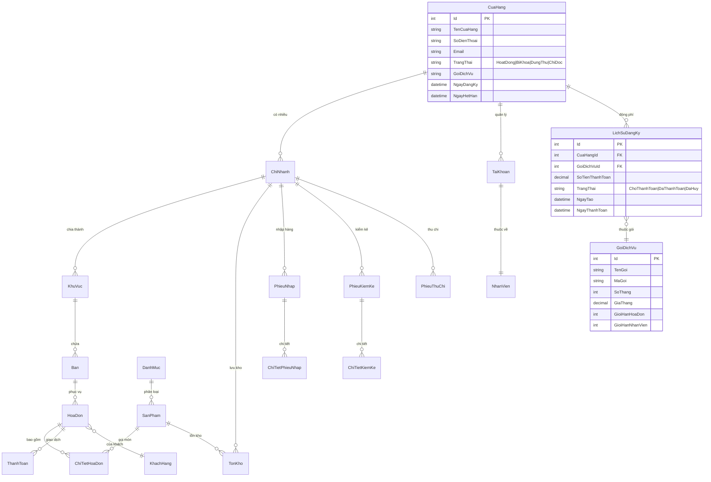
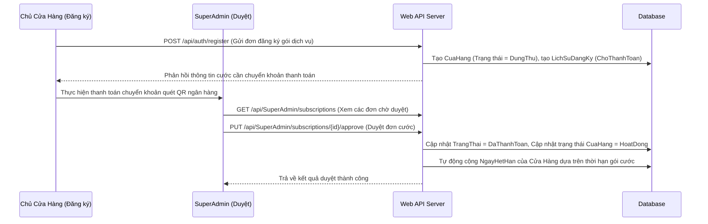

<div align="center">

```
 ██████╗  ██████╗  ██████╗ ██████╗  ██████╗ 
 ██╔══██╗██╔═══██╗██╔════╝ ╚════██╗ ██╔════╝ 
 ██████╔╝██║   ██║╚█████╗   █████╔╝ ███████╗ 
 ██╔═══╝ ██║   ██║ ╚═══██╗  ╚═══██╗ ██╔═══██╗
 ██║     ╚██████╔╝██████╔╝ ██████╔╝ ╚██████╔╝
 ╚═╝      ╚═════╝ ╚═════╝  ╚═════╝   ╚═════╝ 
```

# 🍽️ POS36 — Hệ Thống Quản Lý Bán Hàng F&B & Nền Tảng SaaS F&B

**Giải pháp Point of Sale toàn diện & Nền tảng SaaS quản trị đa chi nhánh dành cho Nhà hàng · Quán Cà phê · Chuỗi Cửa hàng Ăn uống**

[](https://dotnet.microsoft.com/)
[](https://vuejs.org/)
[](https://www.microsoft.com/sql-server)
[](https://dotnet.microsoft.com/apps/aspnet/signalr)
[](https://ai.google.dev/)
[](https://www.docker.com/)

[🚀 Bắt Đầu Nhanh](#-cài-đặt-nhanh-với-docker) · [📖 Mục Lục](#-mục-lục) · [🎯 Tính Năng](#-tính-năng-nổi-bật) · [🏗️ Kiến Trúc](#-kiến-trúc-hệ-thống) · [🤖 AI Copilot](#-trợ-lý-ai-siêu-trí-tuệ-superadmin-ai-agent)

</div>

---

## 📋 Mục Lục

- [Giới Thiệu](#-giới-thiệu)
- [Tính Năng Nổi Bật](#-tính-năng-nổi-bật)
- [Trợ Lý AI Siêu Trí Tuệ (SuperAdmin AI Agent)](#-trợ-lý-ai-siêu-trí-tuệ-superadmin-ai-agent)
- [Kiến Trúc Hệ Thống](#-kiến-trúc-hệ-thống)
- [Mô Hình Dữ Liệu (ERD)](#-mô-hình-dữ-liệu-erd)
- [Use Case Diagram](#-use-case-diagram)
- [Cài Đặt Nhanh với Docker](#-cài-đặt-nhanh-với-docker)
- [Cài Đặt Thủ Công](#-cài-đặt-thủ-công)
- [Scripts Khởi Động Nhanh (Windows)](#-scripts-cài-đặt-và-khởi-động-windows)
- [Công Nghệ Sử Dụng](#-công-nghệ-sử-dụng)
- [API Documentation](#-api-documentation)
- [Phân Quyền & Bảo Mật](#-phân-quyền--bảo-mật)
- [Luồng Hoạt Động](#-luồng-hoạt-động)
- [Thông Tin Dự Án](#-thông-tin-dự-án)

---

## 🚀 Giới Thiệu

**POS36** là một hệ sinh thái quản lý bán hàng (Point of Sale) thế hệ mới, được thiết kế chuyên biệt cho mô hình kinh doanh **F&B (Food & Beverage)** và vận hành dưới dạng một nền tảng **SaaS (Software as a Service)** đa cửa hàng, đa chi nhánh. 

Hệ thống giải quyết triệt để bài toán quản lý vận hành từ khâu gọi món tại bàn, đồng bộ bếp theo thời gian thực, quản lý kho tự động cho tới hệ thống kiểm soát tài chính, doanh thu dành cho Chủ cửa hàng và Cổng quản trị phân tích tự động bằng trí tuệ nhân tạo (AI) cấp cao dành cho Quản trị viên hệ thống (SuperAdmin).

### 🎯 Vấn Đề Giải Quyết

* **Đồng bộ thời gian thực:** Kết nối tức thời luồng công việc giữa Phục vụ - Bếp - Thu ngân qua mạng kết nối không dây.
* **Mô hình SaaS F&B:** Cho phép đăng ký dịch vụ, kích hoạt chuỗi cửa hàng, quản lý thời hạn gói cước tự động.
* **Quản trị kho thông minh:** Tự động trừ kho nguyên liệu khi bán hàng, lập phiếu nhập xuất, kiểm kê đối chiếu.
* **Tài chính chặt chẽ:** Tự động ghi chép sổ quỹ thu chi phát sinh từ hóa đơn bán hàng và phiếu nhập hàng.
* **Báo cáo động bằng AI:** Loại bỏ các biểu mẫu báo cáo tĩnh cứng nhắc, thay vào đó là hệ thống tự phân tích và sinh báo cáo HTML động thông minh bằng AI.

---

## ✨ Tính Năng Nổi Bật

### 1. 🤖 Trợ Lý AI Siêu Trí Tuệ (SuperAdmin AI Agent)
* Sử dụng mô hình **Gemini 3.1 Flash Lite** thế hệ mới (năm 2026) làm nhân tố cốt lõi, mang lại tốc độ phản hồi siêu tốc và tối ưu hạn mức (quota) API.
* AI được huấn luyện sâu sắc về cấu trúc cơ sở dữ liệu (`Prompts/SuperAdmin_Agent.md`), có khả năng đọc hiểu thực tế và thực thi các thao tác hệ thống an toàn.
* **XuatBaoCaoAI:** Tự động chuyển đổi dữ liệu thô từ Database thành các biểu mẫu báo cáo HTML chuyên nghiệp, hiển thị trực quan trên giao diện tối chuyên dụng.

### 2. 📡 Real-time với SignalR
* **Đồng bộ bếp:** Phục vụ thêm món trên thiết bị di động -> Bếp nhận ngay order lập tức không độ trễ.
* **Trạng thái bàn ăn:** Cập nhật trực quan màu sắc bàn (Trống, Đang sử dụng, Chờ thanh toán) trên toàn bộ máy của các nhân viên.
* **Thông báo tức thời:** Cảnh báo khi có giao dịch thanh toán hoặc yêu cầu duyệt đơn từ chi nhánh.

### 3. 🏪 Quản Lý Đa Cửa Hàng & Đa Chi Nhánh (SaaS Core)
* Cấp phát tài nguyên độc lập cho từng Cửa hàng khi đăng ký gói cước F&B.
* Phân chia tồn kho, sản phẩm và dòng tiền chi tiết đến từng chi nhánh riêng biệt.
* Trang chủ quản trị **SuperAdmin Portal** theo dõi sức khỏe toàn bộ hệ thống: thống kê tăng trưởng doanh thu, kiểm tra danh sách cửa hàng đăng ký, phê duyệt đơn hàng cước phí bán tự động.

### 4. 🔐 Phân Quyền Chi Tiết (Role-Based Access Control)
Phân chia vai trò rõ ràng với 6 phân quyền hệ thống kèm các giao diện nghiệp vụ riêng biệt:
* **SuperAdmin (Qu trị tối cao):** Cấu hình toàn hệ thống, phê duyệt gói, chat AI điều khiển hệ thống.
* **Chủ Cửa Hàng (Owner):** Xem báo cáo tài chính toàn diện, quản lý chuỗi chi nhánh, nhân sự.
* **Quản Lý (Manager):** Quản lý tồn kho chi nhánh, lập phiếu thu chi, sơ đồ bàn.
* **Thu Ngân (Cashier):** Thực hiện bán hàng nhanh tại quầy, in hóa đơn, đổi điểm thành viên.
* **Phục Vụ (Waiter):** Giao diện Tablet/Mobile gọi món nhanh, chuyển bàn, gộp bàn.
* **Bếp (Kitchen Console):** Giao diện hiển thị danh sách chế biến, cập nhật trạng thái món ăn.

### 5. 💳 Thanh Toán Đa Kênh Tích Hợp
* Hỗ trợ thanh toán tiền mặt, quẹt thẻ và đặc biệt là thanh toán chuyển khoản qua **QR Code động**.
* Tích hợp Webhook đồng bộ trạng thái thanh toán tự động khi tiền về tài khoản ngân hàng.
* In hóa đơn bán hàng chuyên nghiệp với mẫu tùy chỉnh.

---

## 🤖 Trợ Lý AI Siêu Trí Tuệ (SuperAdmin AI Agent)

Hệ thống tích hợp một bộ não trí tuệ nhân tạo nâng cao được thiết kế cho quyền quản trị SuperAdmin:

```
[Người dùng] ──> Prompt: "Hãy thống kê doanh thu tháng này và lập báo cáo" 
                                    │
                                    ▼
[AI Agent] ───> Nhận diện nghiệp vụ & Tự động gọi API truy vấn dữ liệu thực tế
                                    │
                                    ▼
[Database] ───> Trả về dữ liệu JSON (Cửa hàng, giao dịch, lịch sử đóng cước)
                                    │
                                    ▼
[Gemini 3.1] ──> Phân tích và sinh mã HTML thuần (Dark Theme, HSL Color, Responsive)
                                    │
                                    ▼
[Giao diện] ───> Tự động điều hướng và kết xuất Dashboard Báo Cáo AI chuyên sâu cực đẹp
```

* **Cơ chế gọi hàm (Function Calling):** AI có quyền đề xuất thực thi các hàm nghiệp vụ hệ thống như: `DanhSachCuaHang`, `XemNhatKy`, `ThongKeSaaS`, `XuatBaoCaoAI`, `GiaHanGoi`, `KhoaCuaHang`.
* **Luồng phê duyệt an toàn (Security Check):** Đối với các tác vụ nhạy cảm hoặc có độ rủi ro cao (như Khóa cửa hàng, Cấu hình lại hệ thống), giao diện sẽ hiển thị một **Hộp thoại phê duyệt hành động của AI**, yêu cầu người dùng xác nhận thủ công trước khi gửi lệnh xuống Database.
* **Tối ưu hóa UX hội thoại:** Hệ thống sử dụng Axios Interceptor thông minh để bỏ qua Loading Overlay khi chat AI, giúp trải nghiệm trao đổi đa bước diễn ra liền mạch, không gián đoạn công việc của quản trị viên.

---

## 🏗️ Kiến Trúc Hệ Thống



### Luồng Gọi Món & Chế Biến Thời Gian Thực



---

## 🗄️ Mô Hình Dữ Liệu (ERD)

### Sơ đồ ERD Tổng Quan Hệ Thống



### Chi Tiết Phân Hệ Cơ Sở Dữ Liệu

1. **Phân Hệ SaaS (Quản lý đa nền tảng):**
   * `CuaHang`: Lưu thông tin chi tiết từng thương hiệu đăng ký, thời gian hiệu lực cước phí.
   * `GoiDichVu`: Gói dịch vụ F&B (với các ngưỡng giới hạn nhân viên, giới hạn hóa đơn).
   * `LichSuDangKy`: Lịch sử đóng phí kích hoạt hoặc gia hạn cước.
2. **Phân Hệ Cửa Hàng & Bán Hàng:**
   * `ChiNhanh`, `TaiKhoan`, `NhanVien`: Bộ khung quản lý nhân sự cục bộ của từng cửa hàng.
   * `KhuVuc`, `Ban`: Sơ đồ mặt bằng chi tiết (Tầng 1, Sân vườn, VIP...).
   * `DanhMuc`, `SanPham`: Thực đơn món ăn kèm giá bán, hình ảnh và trạng thái phục vụ.
   * `HoaDon`, `ChiTietHoaDon`, `ThanhToan`: Theo dõi chặt chẽ dòng hóa đơn bán ra.
3. **Phân Hệ Kho & Tài Chính:**
   * `TonKho`: Theo dõi số lượng tồn chính xác của từng sản phẩm tại từng chi nhánh.
   * `PhieuNhap`, `ChiTietPhieuNhap`: Theo dõi chi phí nhập nguyên liệu đầu vào.
   * `PhieuKiemKe`, `ChiTietKiemKe`: Biên bản đối soát chênh lệch hao hụt nguyên liệu thực tế.
   * `PhieuThuChi`: Sổ quỹ dòng tiền mặt thực tế tại cửa hàng (Hóa đơn bán ra tạo Phiếu Thu tự động; Phiếu Nhập hàng hoàn tất tạo Phiếu Chi tự động).

---

## 🎭 Use Case Diagram

```mermaid
graph TB
    subgraph "Hệ Thống Phân Quyền Sử Dụng"
        CCH[Chủ Cửa Hàng]
        QL[Quản Lý Chi Nhánh]
        TN[Thu Ngân]
        PV[Phục Vụ]
        BEP[Bếp Chế Biến]
        SAD[SuperAdmin Hệ Thống]
    end
    
    subgraph "Cổng Quản Trị SaaS"
        UC_SAD1[Giám sát SaaS Dashboard]
        UC_SAD2[Duyệt gia hạn cước cở hàng]
        UC_SAD3[Khóa/Mở khóa cửa hàng]
        UC_SAD4[Trò chuyện điều khiển bằng AI]
    end
    
    subgraph "Hoạt Động POS & Chế Biến"
        UC_POS1[Thiết lập sơ đồ bàn ăn]
        UC_POS2[Gọi món - Order]
        UC_POS3[Chuyển bàn / Ghép bàn]
        UC_POS4[Nhận order - Chế biến món]
        UC_POS5[Tính tiền - In hóa đơn]
    end
    
    subgraph "Quản Lý Kho & Tài Chính"
        UC_INV1[Lập phiếu nhập kho]
        UC_INV2[Kiểm kê kho thực tế]
        UC_FIN1[Lập phiếu thu/chi thủ công]
        UC_FIN2[Xem sổ quỹ tài chính]
        UC_FIN3[AI phân tích tình hình kinh doanh]
    end
    
    SAD --> UC_SAD1
    SAD --> UC_SAD2
    SAD --> UC_SAD3
    SAD --> UC_SAD4
    
    QL --> UC_POS1
    PV --> UC_POS2
    PV --> UC_POS3
    BEP --> UC_POS4
    TN --> UC_POS5
    
    QL --> UC_INV1
    QL --> UC_INV2
    QL --> UC_FIN1
    QL --> UC_FIN2
    
    CCH --> UC_FIN3
    CCH --> UC_FIN2
```



---

## 🐳 Cài Đặt Nhanh với Docker

### Yêu Cầu Tối Thiểu
* Docker Desktop (Windows/Mac) hoặc Docker Engine (Linux).
* RAM trống: Tối thiểu 4GB.
* Dung lượng đĩa trống: 10GB.

### Bước 1: Tải mã nguồn về máy
```bash
git clone https://github.com/Nhanduc2912/POS36.git
cd POS36
```

### Bước 2: Khởi chạy Containers hệ thống
```bash
docker-compose up -d
```

### Bước 3: Nạp cấu trúc & Dữ liệu mẫu ban đầu
Đợi khoảng 30 giây để SQL Server Docker khởi chạy thành công hệ thống, sau đó thực thi lệnh nạp database:
```bash
# Đối với Windows PowerShell:
docker exec -it pos36-db /opt/mssql-tools/bin/sqlcmd -S localhost -U sa -P "Pos36_Secret_Password_123!" -i /Pos36DB.sql

# Đối với Linux / MacOS:
docker exec -it pos36-db /opt/mssql-tools/bin/sqlcmd -S localhost -U sa -P 'Pos36_Secret_Password_123!' -i /Pos36DB.sql
```

### Bước 4: Kiểm tra hoạt động
* **Ứng dụng Web (Frontend):** [http://localhost:3000](http://localhost:3000)
* **Backend API Gateway:** [http://localhost:5098](http://localhost:5098)
* **Swagger API UI:** [http://localhost:5098/swagger](http://localhost:5098/swagger)

---

## 🛠️ Cài Đặt Thủ Công

### Yêu Cầu Cài Đặt Trước
* **Backend:** .NET 9.0 SDK, Microsoft SQL Server 2019+ (hoặc bản Express).
* **Frontend:** Node.js v18 trở lên và công cụ quản lý thư viện `npm`.

### Bước 1: Khởi tạo Database
1. Mở công cụ quản lý cơ sở dữ liệu (SSMS hoặc Azure Data Studio).
2. Kết nối tới SQL Server cục bộ của bạn.
3. Tạo cơ sở dữ liệu tên: `POS36_Db`.
4. Mở tệp SQL `Pos36DB.sql` nằm ở thư mục gốc của dự án và chạy thực thi (Execute) toàn bộ script để tạo bảng và dữ liệu mẫu.

### Bước 2: Thiết lập Backend
1. Điều hướng vào thư mục backend:
   ```bash
   cd POS36.Api/POS36.Api
   ```
2. Cấu hình tệp `appsettings.json` liên kết với chuỗi kết nối và API Key của bạn:
   ```json
   {
     "ConnectionStrings": {
       "DefaultConnection": "Server=localhost;Database=POS36_Db;Trusted_Connection=True;TrustServerCertificate=True;"
     },
     "GeminiAI": {
       "ApiKey": "API_KEY_GOOGLE_AI_STUDIO_CỦA_BẠN"
     }
   }
   ```
3. Thực thi phục hồi thư viện và khởi chạy:
   ```bash
   dotnet restore
   dotnet run
   ```
   *Ứng dụng Backend API sẽ khởi động tại:* `http://localhost:5098`

### Bước 3: Thiết lập Frontend
1. Mở một cửa sổ dòng lệnh mới và chuyển đến thư mục frontend:
   ```bash
   cd POS36.Web
   ```
2. Cài đặt toàn bộ thư viện cần thiết:
   ```bash
   npm install
   ```
3. Tạo tệp cấu hình môi trường `.env` tại thư mục này với nội dung:
   ```env
   VITE_API_URL=/api
   VITE_SIGNALR_URL=http://localhost:5098/kitchenHub
   ```
4. Khởi chạy máy chủ phát triển frontend:
   ```bash
   npm run dev
   ```
   *Giao diện Web sẽ hoạt động tại:* `http://localhost:5173`

---

## ⚡ Scripts Cài Đặt và Khởi Động (Windows)

Dự án cung cấp bộ các tệp thực thi batch script tự động nằm gọn gàng tại thư mục `scripts/` giúp việc lập trình và chạy hệ thống trở nên nhanh chóng chỉ với các cú đúp chuột:

1. **`scripts\setup.bat`**: Tự động kiểm tra cài đặt .NET SDK, cài đặt Node dependencies, hỗ trợ tạo database ban đầu.
   * *Cách dùng:* Chuột phải chọn **Run as Administrator** (Chỉ chạy duy nhất ở lần đầu thiết lập dự án).
2. **`scripts\run.bat`**: Tự động dò tìm các tiến trình cũ, tắt chúng đi và khởi động đồng thời cả Front-end & Back-end API.
   * *Cách dùng:* Click đúp chuột để mở ứng dụng lập tức.
3. **`scripts\stop.bat`**: Dừng nhanh và giải phóng toàn bộ cổng kết nối bị chiếm dụng bởi các dịch vụ chạy ngầm.
   * *Cách dùng:* Click đúp để tắt hệ thống an toàn.
4. **`scripts\build.bat`**: Build nén mã nguồn thành phiên bản phân phối production cho cả 2 nền tảng.

---

## 🔧 Công Nghệ Sử Dụng

### Backend Stack
* **Chung:** ASP.NET Core 9.0 (Web API Framework hiệu năng cao).
* **ORM:** Entity Framework Core 9.0 (Quản trị luồng cơ sở dữ liệu qua các thực thể C#).
* **Database:** Microsoft SQL Server (Lưu trữ quan hệ bền vững).
* **Bảo mật:** JWT Bearer (Token mã hóa phân quyền), BCrypt.Net (Băm mật khẩu bảo mật tuyệt đối).
* **Realtime:** ASP.NET Core SignalR (Đồng bộ bếp và trạng thái hóa đơn tức thời).
* **Ghi nhật ký:** Serilog (Ghi log hệ thống có cấu trúc).
* **AI API Client:** HTTP Client tích hợp kết nối API Google AI Studio (Gemini 3.1 Flash Lite - v1beta).

### Frontend Stack
* **Core:** Vue.js v3.5 (Composition API SFC) kết hợp bộ build công cụ siêu tốc **Vite**.
* **Router:** Vue Router v5.0 (Cơ chế chuyển hướng trang nhẹ nhàng).
* **CSS Framework:** Vanilla CSS tối ưu hóa cùng Bootstrap 5.3 mang lại giao diện phản hồi tốt trên mọi màn hình.
* **Biểu đồ:** Chart.js (Kết xuất biểu đồ phân tích trực quan).
* **Thư viện phụ:** Axios (Gọi API), SweetAlert2 (Hộp thoại thông báo mượt mà), XLSX (Xuất báo cáo Excel).

---

## 📡 API Documentation

### Luồng Gọi Endpoint Chính

Mọi yêu cầu API đến hệ thống đều có tiền tố `/api` và ngoại trừ các endpoint đăng ký/đăng nhập, tất cả các tác vụ còn lại đều yêu cầu truyền Token JWT bảo mật trong phần Header:
```
Authorization: Bearer <tệp_token_jwt_của_bạn>
```

#### 1️⃣ Phân Hệ Đăng Nhập
* **`POST /api/auth/register`**: Tạo thương hiệu, cửa hàng, tài khoản admin mới.
* **`POST /api/auth/login`**: Đăng nhập hệ thống, trả về Token JWT và Quyền hạn sử dụng.

#### 2️⃣ Phân Hệ Gọi Món & POS
* **`POST /api/hoadon/goimon`**: Gửi món yêu cầu phục vụ từ bàn xuống màn hình bếp.
* **`POST /api/hoadon/thanhtoan/{banId}`**: Tính tiền hóa đơn bàn ăn, trừ tồn kho nguyên liệu tương ứng và tạo phiếu thu.
* **`GET /api/hoadon/pending`**: Thu thập danh sách hóa đơn chưa thanh toán.

#### 3️⃣ Phân Hệ Trợ Lý AI
* **`POST /api/aichat/chat`**: Gửi prompt hội thoại đa bước tới AI Agent (Gemini 3.1 Flash Lite).
* **`POST /api/aichat/confirm`**: Phê duyệt các hành động đề xuất của AI Agent gửi tới Database.
* **`POST /api/aichat/report`**: Thu thập dữ liệu thực tế từ Database gửi cho AI tự dựng mã HTML động làm báo cáo.
* **`GET /api/aichat/models`**: Lấy danh sách các model AI được hỗ trợ từ tài khoản Google AI Studio.

---

## 🔐 Phân Quyền & Bảo Mật

### Ma Trận Phân Quyền Hệ Thống (RBAC Matrix)

| Quyền hạn chi tiết | SuperAdmin | Chủ Cửa Hàng | Quản Lý | Thu Ngân | Phục Vụ | Bếp |
|--------------------|:----------:|:------------:|:-------:|:--------:|:-------:|:---:|
| Cấu hình toàn SaaS |     ✅      |      ❌      |    ❌   |    ❌    |    ❌   |  ❌  |
| Duyệt gia hạn cước |     ✅      |      ❌      |    ❌   |    ❌    |    ❌   |  ❌  |
| Quản lý chuỗi CH   |     ❌      |      ✅      |    ❌   |    ❌    |    ❌   |  ❌  |
| Lập sơ đồ bàn ăn   |     ❌      |      ✅      |    ✅   |    ❌    |    ❌   |  ❌  |
| Nhập kho nguyên liệu|    ❌      |      ✅      |    ✅   |    ❌    |    ❌   |  ❌  |
| Quản lý sổ quỹ     |     ❌      |      ✅      |    ✅   |    ❌    |    ❌   |  ❌  |
| Thực hiện thanh toán|    ❌      |      ✅      |    ✅   |    ✅    |    ❌   |  ❌  |
| Tạo phiếu gọi món  |     ❌      |      ✅      |    ✅   |    ✅    |    ✅   |  ❌  |
| Chế biến món ăn    |     ❌      |      ❌      |    ❌   |    ❌    |    ❌   |  ✅  |
| Trò chuyện điều hành AI|  ✅      |      ❌      |    ❌   |    ❌    |    ❌   |  ❌  |

---

## 🔄 Luồng Hoạt Động

### Luồng Duyệt Đăng Ký Gói Cước SaaS (SuperAdmin Flow)



---

## 📋 Thông Tin Dự Án

* **Tác giả:** Nhân Đức
* **Trường đào tạo:** FPT Polytechnic
* **Môn chuyên ngành:** Phát triển ứng dụng (.NET)
* **Email liên hệ:** [nhanduc29122008@gmail.com](mailto:nhanduc29122008@gmail.com)
* **Mã nguồn dự án:** [GitHub Nhanduc2912/POS36](https://github.com/Nhanduc2912/POS36)

---

## 📄 License

Dự án này được phân phối tự do dưới giấy phép bản quyền phần mềm mã nguồn mở **MIT License**.

---

<div align="center">

**Made with ❤️ — FPT Polytechnic | Môn: Phát triển ứng dụng (.Net)**

[GitHub](https://github.com/Nhanduc2912/POS36) · [Email](mailto:nhanduc29122008@gmail.com)

[⬆ Quay lại đầu trang](#🍽️-pos36--hệ-thống-quản-lý-bán-hàng-fb--nền-tảng-saas-fb)

</div>
